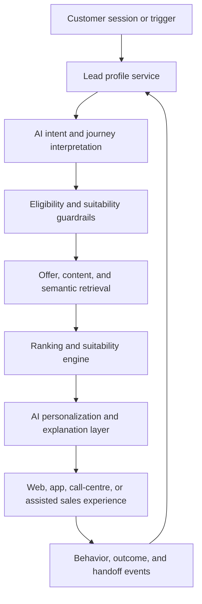

# Dynamic Lead Generation Personalization Platform

## Overview

This repository defines a presentation-ready architecture for an **AI-powered, multi-vertical lead-generation platform** that helps service businesses convert more of the right customers, not just generate more traffic.

It is designed for environments where the same platform must support multiple service categories such as:

- novated leasing
- health insurance
- broadband and utilities
- adjacent quote-led, callback-led, or application-led services

The core challenge is not content delivery alone. It is deciding, in each session, which combination of:

- offer
- supporting content
- comparison or calculator tool
- next-best call to action

is most likely to move a customer toward a **qualified conversion outcome**, with AI helping interpret intent, surface the best candidates, and adapt the journey in real time.

That decision has to balance:

- current intent
- eligibility and suitability
- provider and campaign priorities
- channel context
- returning-customer history
- AI-guided interpretation and recommendation quality
- explainability for product, sales, operations, and compliance teams

This architecture is built around that problem.

---

## Why This Platform Matters

Many service businesses already have strong acquisition channels, campaign tooling, and content operations, but still struggle with the same structural issues:

- too many customers see generic journeys that do not match their actual needs
- returning visitors are treated like new leads instead of re-evaluated prospects
- content platforms know what exists, but not what should be shown
- campaign priorities override customer relevance too aggressively
- lead volume is measured more easily than lead quality and downstream conversion
- deterministic-only logic can struggle to capture nuance across complex, returning, or cross-vertical journeys

The result is wasted media spend, inconsistent customer journeys, weaker handoff quality, and limited confidence in optimization decisions.

This platform addresses those gaps by combining **structured customer state**, **AI-assisted intent and retrieval**, **deterministic decisioning guardrails**, **managed content metadata**, and **closed-loop analytics** so teams can improve both:

- **new lead generation**
- **returning-customer re-engagement and repeat conversion**

---

## Strategic Outcomes

The platform is intended to help the business:

- increase qualified lead volume across service categories
- improve visit-to-quote, visit-to-application, and visit-to-callback conversion
- re-engage returning customers with more relevant journeys based on prior behavior
- support cross-sell, renewal, and re-entry use cases without creating separate stacks
- use AI to improve personalization quality, explanation quality, and assisted-sales guidance
- make provider prioritization and commercial goals visible within explainable rules
- create a shared operating model for product, engineering, marketing, and sales

---

## What The Platform Does

At a practical level, the platform should:

1. observe meaningful customer and session signals
2. maintain a durable customer profile and evolving journey states over time
3. use AI and rules together to infer current intent, urgency, and likely conversion stage
4. retrieve eligible offers and supporting content using structured metadata and semantic retrieval
5. rank candidates using deterministic suitability logic plus AI-assisted relevance signals
6. generate the best next action, explanation, or guided experience for the current session
7. measure downstream quality so both rules and AI-assisted journey design improve over time

This makes the experience feel adaptive, intelligent, and increasingly context-aware without making the decisioning opaque.

---

## High-Level Platform Flow

This flow is deliberately built around a feedback loop. A customer is not evaluated once and then forgotten. The system should continuously improve its view of both:

- **what the customer is trying to do now**
- **what AI can infer about the best journey, content, and support for that customer**
- **what tends to convert well for similar customers over time**

---

## Architecture Goals

The platform aims to:

- identify which service category and journey type a customer is most likely to convert in
- tailor journeys for research, comparison, quote, application, callback, renewal, and return-visit scenarios
- support multiple verticals through configuration and metadata instead of separate architectures
- optimize for qualified lead volume, lead quality, and downstream activation or policy conversion
- embed AI directly into intent interpretation, retrieval, explanation, and guided conversion journeys
- keep ranking, eligibility, and suitability logic explicit, reviewable, and explainable
- separate managed content operations from backend decisioning responsibilities
- use deterministic controls so AI can be powerful without becoming the system of record for policy decisions

---

## Design Principles

### Optimize For Qualified Conversion

The platform should optimize for outcomes that matter to the business, including:

- quote starts
- application progression
- callback requests
- qualified handoff to providers or internal sales teams
- activation, policy conversion, or funded outcome where available

Raw engagement is useful context, but it is not the primary success measure.

### Treat Every Session As A Re-Evaluation Event

Customer intent changes quickly in service journeys. A returning visitor may be:

- closer to purchase
- researching a different product
- price-comparing after an abandoned quote
- revisiting because of renewal timing or life-stage change

Each meaningful session should therefore refresh the customer's state, not replay a static journey.

### Keep Content And Offers Separate From Decisioning

The CMS and offer catalog should manage:

- content assets
- campaign metadata
- offer definitions
- editorial governance

Backend services should own:

- state evaluation
- eligibility and suitability logic
- ranking and prioritization
- next-best-action selection
- explanation and observability

### Make AI A First-Class Personalization Layer

AI should play an active role in:

- interpreting messy or incomplete customer intent
- improving retrieval across offers, guides, and tools
- generating explanations, summaries, and guided next steps
- supporting conversational and assisted-sales experiences
- helping teams discover higher-performing patterns over time

At the same time, authoritative decisions such as suitability policy, hard eligibility constraints, and protected campaign controls should remain deterministic and auditable.

---

## Recommended Technology Stack

| Area | Technology |
|---|---|
| Experience and decisioning services | .NET |
| Operational profile storage | Cosmos DB |
| CMS and offer metadata | Contentful |
| AI services | Azure OpenAI |
| Semantic search | Azure AI Search |
| APIs | GraphQL + REST |
| Hosting and integration | Azure |

These choices reflect the current reference architecture, not a product requirement that every deployment must follow unchanged.

---

## Documentation Structure

The documents below move from business framing into implementation guidance.

## Architecture

| Document | Description |
|---|---|
| [01-overview.md](./docs/architecture/01-overview.md) | Platform vision, business goals, why now, and multi-vertical lead-generation framing |
| [02-customer-state-model.md](./docs/architecture/02-customer-state-model.md) | Lead profile, intent, eligibility, renewal, and lead-scoring model |
| [03-content-personalization-strategy.md](./docs/architecture/03-content-personalization-strategy.md) | Offer, content, CTA, and next-best-action decisioning strategy |
| [04-system-architecture.md](./docs/architecture/04-system-architecture.md) | Technical architecture, service boundaries, and end-to-end decision flow |

---

## Services

| Document | Description |
|---|---|
| [05-contentful-integration.md](./docs/services/05-contentful-integration.md) | CMS and offer metadata design, governance, and operating model |
| [06-customer-profile-service.md](./docs/services/06-customer-profile-service.md) | Event-driven customer profile and journey-state service implementation guidance |
| [07-ranking-engine.md](./docs/services/07-ranking-engine.md) | Ranking, suitability, prioritization, and explainability model |

---

## AI

| Document | Description |
|---|---|
| [08-ai-and-rag-strategy.md](./docs/ai/08-ai-and-rag-strategy.md) | AI boundaries, RAG strategy, and assistive use cases |
| [09-vector-search-design.md](./docs/ai/09-vector-search-design.md) | Semantic retrieval for offers, guidance, and lead-support journeys |

---

## Operations

| Document | Description |
|---|---|
| [10-feedback-and-analytics.md](./docs/operations/10-feedback-and-analytics.md) | Analytics, lead-quality measurement, returning-customer insights, and optimization loops |

---

## Delivery

| Document | Description |
|---|---|
| [11-roadmap.md](./docs/delivery/11-roadmap.md) | Phased rollout across deterministic, behavioral, and AI-assisted capabilities |

---

## Recommended Delivery Approach

### Phase 1 - AI-Assisted Decisioning Foundation

Initial implementation should focus on:

- customer profiles and journey states
- service metadata and offer taxonomy
- deterministic eligibility and suitability rules
- AI-assisted intent interpretation and semantic retrieval
- vertical-aware ranking and next-best-action selection
- basic analytics for lead quality and provider handoff

This establishes an AI-enabled operating model while keeping the first release controlled and explainable.

### Phase 2 - AI-Optimized Personalization

Enhance personalization using:

- richer behavioral tracking
- intent refinement
- returning-customer recognition and re-entry logic
- AI-assisted recommendation tuning and explanation generation
- lead-quality analytics by channel, vertical, and provider
- configurable weighting of ranking signals by vertical

This phase should improve both conversion efficiency and journey relevance at higher scale.

### Phase 3 - AI-Native Guidance And Orchestration

Introduce:

- conversational guidance
- proactive AI journey orchestration
- deeper semantic retrieval and answer generation
- personalized summaries and recommendation explanations
- RAG-based support for more complex research and assisted-sales journeys

At this stage, AI becomes a major part of how the platform interacts with customers and internal teams, while deterministic systems remain authoritative for critical controls.

---

## Audience Alignment

This body of work is intended to support both product and engineering discussion.

For **product teams**, it clarifies:

- what business problem the platform solves
- which customer outcomes it should optimize for
- how AI improves journey quality, discovery, and assisted conversion
- how multiple verticals can share one architecture
- where campaign, provider, and operating priorities fit

For **engineering teams**, it clarifies:

- which services own which responsibilities
- how profile, AI interpretation, retrieval, ranking, and analytics should interact
- why deterministic guardrails still matter in an AI-forward platform
- where AI should be embedded from day one versus scaled over time

---

## Summary

This platform is designed as an **AI-forward, multi-vertical lead-generation architecture** that combines:

- structured customer state
- AI-assisted interpretation and retrieval
- deterministic decisioning
- suitability-aware ranking
- managed content and offer metadata
- analytics-driven optimization
- guided and conversational experiences

The architecture prioritizes:

- qualified lead generation
- returning-customer re-engagement
- AI-enhanced personalization quality
- explainability
- compliance-aware promotion
- scalability across service categories
- long-term extensibility
