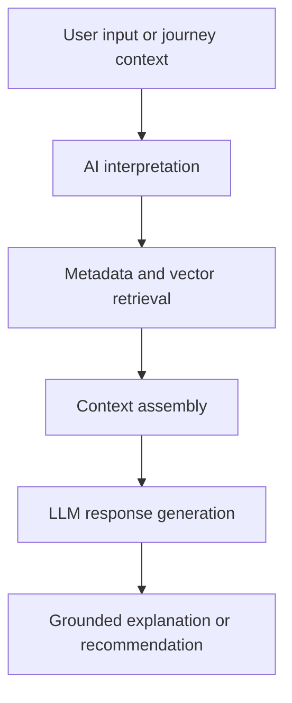

# AI and RAG Strategy

> **Navigation:** [Docs home](../../README.md#documentation-structure) | [Next: Vector Search Design ->](./09-vector-search-design.md)

## Overview

This document defines how AI and Retrieval-Augmented Generation should be used within the lead-generation platform.

The guiding principle is:

> AI should be a first-class experience and interpretation layer, while deterministic systems remain authoritative for protected decisions

AI is used to improve:

- active-journey interpretation
- content and offer explanation
- conversational guidance
- semantic retrieval
- personalization quality
- returning-customer understanding

It should play a major role in the platform, but not own ranking policy, eligibility, or compliance outcomes.

---

## How To Read This Section

Use this overview page for AI boundaries, safe use cases, and operating-model expectations. For runtime detail, use:

| Detail page | Best for | Covers |
|---|---|---|
| [Runtime and Implementation](./ai-and-rag-strategy/01-runtime-and-implementation.md) | engineering + architecture | runtime components, prompt assembly, journey-interpretation contracts, fallbacks, observability, and evaluation |

---

## Responsibility Split

| Layer | Owns |
|---|---|
| Deterministic systems | ranking, customer and journey scoring, eligibility and suitability rules, provider suppression, campaign logic, and hard business constraints |
| AI systems | interpretation support, summarization, semantic understanding, query expansion, conversational responses, and explanation generation |

AI should improve understanding, discovery, and guidance without becoming the policy engine.

---

## What AI Does Not Do

This is the simplest way to read the architecture:

AI helps the platform **understand, explain, and guide**.

AI does **not** decide the protected things that must stay predictable, testable, and auditable.

### AI Does Not Decide

- whether a customer is eligible
- whether an option is suitable to promote
- which suppressed provider or offer should bypass policy
- which compliance rule can be ignored
- which ranking result should override deterministic constraints

### AI Does Help With

- interpreting messy customer intent
- summarizing journey context
- improving semantic retrieval
- generating grounded explanation text
- supporting conversational guidance

### Simple Rule Of Thumb

If the outcome needs to be defended to product, compliance, sales, or an engineering reviewer, it should not depend on AI alone.

That means AI can be very visible in the experience while deterministic systems remain authoritative underneath it.

---

## Where AI Adds Value

AI is most useful when it improves:

- journey interpretation from messy or incomplete signals
- summaries and explanations that make recommendations easier to understand
- personalized guidance across quote, callback, and application journeys
- conversational support for research and assisted-sales experiences
- query expansion and semantic retrieval across larger offer and content sets

---

## RAG Strategy

### RAG Flow

### RAG Data Sources

RAG can use:

- managed offer and content assets
- customer profile summaries
- journey-state summaries
- provider FAQs
- disclosure and eligibility guidance
- calculator and tool descriptions

## Multi-Journey AI Support

A major platform advantage is helping customers who are active in more than one journey.

AI can help by:

- summarizing parallel journey activity
- identifying which journey seems most relevant in the current session
- surfacing secondary-journey reminders without derailing the primary path
- generating better resume-language for returning customers

This is especially useful when deterministic signals alone are insufficient to disambiguate intent.

---

## Guardrails

AI outputs should:

- remain grounded in retrieved material
- avoid inventing eligibility or suitability outcomes
- defer to deterministic systems for ranking and protected constraints
- avoid personalized advice beyond approved policy boundaries
- be traceable to the content and prompt context used

Recommended safety controls:

- approved grounding sources only
- prompt templates under engineering control
- output moderation and policy checks
- observability for generated responses

---

## Operating Model

To make AI credible in product and engineering review, the platform should define:

- which AI use cases are customer-facing
- which are internal-only
- who approves AI grounding content
- how prompts and model settings are versioned
- how hallucination or policy-risk incidents are reviewed

This matters as much as the model choice itself.

---

| <- Previous | Next -> |
|---|---|
| [Ranking Engine](../services/07-ranking-engine.md) | [Vector Search Design](./09-vector-search-design.md) |
