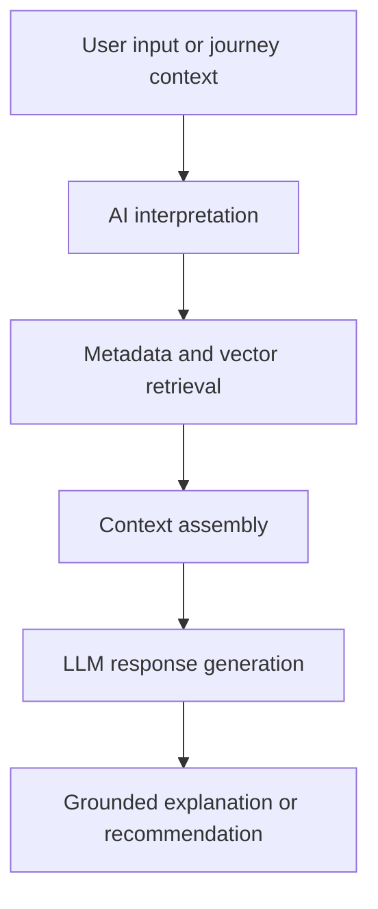

# AI and RAG Strategy

> **Navigation:** [Docs home](../../README.md#documentation-structure) | [Next: Vector Search Design ->](./09-vector-search-design.md)

## Overview

This document defines how AI and Retrieval-Augmented Generation should be used within the lead-generation platform.

The guiding principle is:

> AI should be a first-class experience and interpretation layer, while deterministic systems remain authoritative for protected decisions

AI is used to improve:

- active-journey interpretation
- content and offer explanation
- conversational guidance
- semantic retrieval
- personalization quality
- returning-customer understanding

It should play a major role in the platform, but not own ranking policy, eligibility, or compliance outcomes.

---

## How To Read This Section

Use this overview page for:

- AI boundaries and responsibilities
- customer-facing AI use cases
- RAG purpose and safe usage patterns
- operating-model expectations

For implementation detail, use:

| Detail page | Best for | Covers |
|---|---|---|
| [Runtime and Implementation](./ai-and-rag-strategy/01-runtime-and-implementation.md) | engineering + architecture | runtime components, prompt assembly, journey-interpretation contracts, fallbacks, observability, and evaluation |

---

## Strategic Goals

The AI layer should:

- improve discovery across large multi-vertical content and offer sets
- support natural-language interactions across service categories
- help identify the most relevant current journey when multiple journeys exist
- explain why a recommendation is relevant in human-readable terms
- reduce friction in quote, callback, and application journeys
- remain grounded, reviewable, and safe

---

## AI Vs Deterministic Systems

### Deterministic Systems (Authoritative)

Responsible for:

- ranking logic
- customer-level and journey-level scoring
- eligibility and suitability rules
- provider suppression and campaign logic
- hard business constraints

These must be:

- explainable
- predictable
- testable
- auditable

### AI Systems (Interpretation And Experience Layer)

Responsible for:

- intent interpretation support
- multi-journey disambiguation support
- summarization
- semantic understanding
- conversational responses
- query expansion
- explanation generation

AI should be treated as:

> a powerful intelligence layer that improves understanding, discovery, and guidance without becoming the policy engine

---

## Recommended AI Capabilities

### 1. Journey Interpretation

AI can help infer which journey is most relevant now from:

- form responses
- click behavior
- session activity
- free-text questions
- prior journey history

Example outputs:

- researching options
- comparing providers
- checking eligibility
- ready for quote
- returning to resume

### 2. Offer And Content Summarization

AI can generate:

- short offer summaries
- "why this is relevant" explanations
- plain-language comparisons
- CTA context summaries

This improves:

- comprehension
- confidence
- conversion readiness

### 3. Personalized Guidance

AI can adapt:

- hero messages
- onboarding prompts
- CTA explanations
- reassurance content
- objection-handling summaries

based on:

- service category
- customer profile
- active journey stage
- recent behavior
- returning-customer history

### 4. Conversational Experiences

AI enables:

- quote-prep assistants
- service discovery guidance
- contextual help systems
- eligibility guidance journeys
- assisted-sales support summaries

### 5. Query Expansion

AI can expand user intent into richer search queries.

Example:

User input:
> "best broadband plan for working from home"

Expanded into:

- high-speed broadband
- reliable family household connection
- upload speed considerations
- address availability and contract flexibility

---

## RAG Strategy

### What RAG Should Do

RAG combines:

- retrieval
- grounding context
- generation

to produce responses that are more useful, more accurate, and easier to trust.

### RAG Flow

### RAG Data Sources

RAG can use:

- managed offer and content assets
- customer profile summaries
- journey-state summaries
- provider FAQs
- disclosure and eligibility guidance
- calculator and tool descriptions

### RAG Use Cases

#### Novated Leasing Guidance

- explain salary packaging concepts
- describe employer eligibility requirements
- recommend next calculators or contact actions

#### Health Insurance Discovery

- compare cover tiers in simple language
- explain hospital versus extras trade-offs
- guide leads toward an appropriate quote path

#### Broadband Selection

- explain speed tiers and household fit
- answer moving-house or switching questions
- recommend address-check or quote actions

---

## Multi-Journey AI Support

A major platform advantage is helping customers who are active in more than one journey.

AI can help by:

- summarizing parallel journey activity
- identifying which journey seems most relevant in the current session
- surfacing secondary-journey reminders without derailing the primary path
- generating better resume-language for returning customers

This is especially useful when deterministic signals alone are insufficient to disambiguate intent.

---

## Guardrails

AI outputs should:

- remain grounded in retrieved material
- avoid inventing eligibility or suitability outcomes
- defer to deterministic systems for ranking and protected constraints
- avoid personalized advice beyond approved policy boundaries
- be traceable to the content and prompt context used

Recommended safety controls:

- approved grounding sources only
- prompt templates under engineering control
- output moderation and policy checks
- observability for generated responses

---

## Operating Model

To make AI credible in product and engineering review, the platform should define:

- which AI use cases are customer-facing
- which are internal-only
- who approves AI grounding content
- how prompts and model settings are versioned
- how hallucination or policy-risk incidents are reviewed

This matters as much as the model choice itself.

---

## Summary

AI should be a visible, valuable part of the platform:

- improving journey interpretation
- improving retrieval and explanation
- supporting guided and conversational experiences
- strengthening returning-customer re-engagement

while deterministic systems retain authority over qualification, suitability, ranking, and protected business controls.

---

| <- Previous | Next -> |
|---|---|
| [Ranking Engine](../services/07-ranking-engine.md) | [Vector Search Design](./09-vector-search-design.md) |
