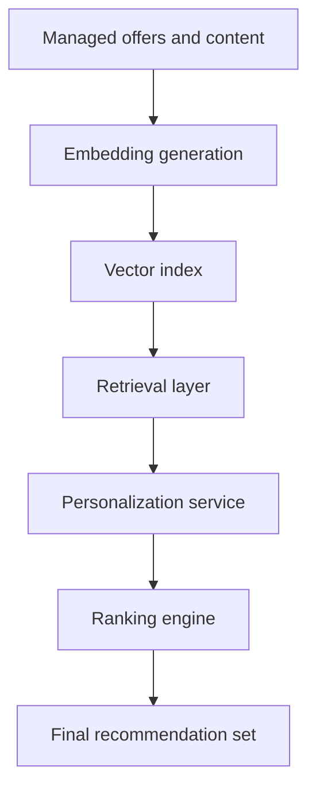
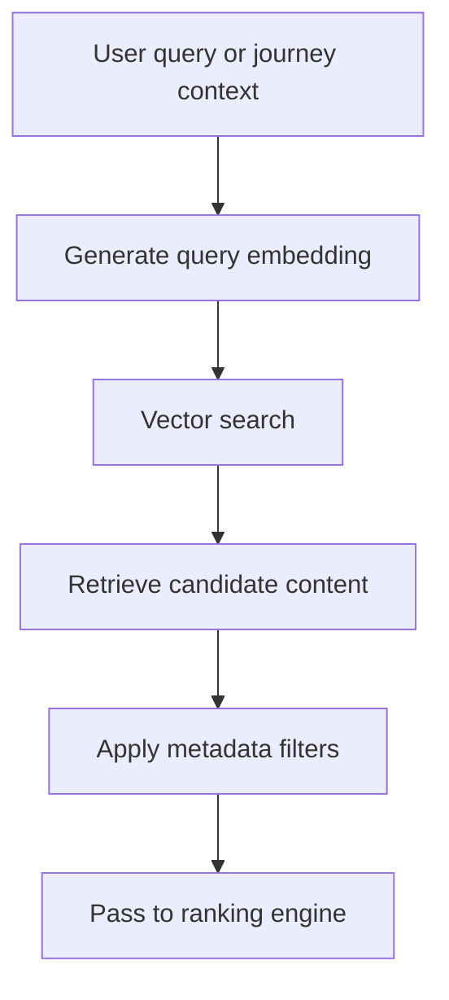

# Vector Search Design

> **Navigation:** [Docs home](../../README.md#documentation-structure) | [Next: Feedback and Analytics ->](../operations/10-feedback-and-analytics.md)

## Overview

Vector search enables semantic retrieval of offers and content based on meaning rather than exact keyword matching.

In this platform, vector search is used to support:

- semantic offer discovery
- AI-enhanced personalization
- conversational experiences
- hybrid retrieval alongside deterministic ranking
- multi-journey intent resolution

Vector search should be a core retrieval capability, but not the authority on final outcomes.

---

## How To Read This Section

Use this overview page for:

- vector-search goals and responsibilities
- embedding and hybrid-retrieval concepts
- multi-journey retrieval guidance
- the boundary between retrieval and ranking

For implementation detail, use:

| Detail page | Best for | Covers |
|---|---|---|
| [Index and Retrieval Implementation](./vector-search-design/01-index-and-retrieval-implementation.md) | engineering + data | index schema, ingestion pipeline, query contracts, tuning, caching, and retrieval evaluation |

---

## Goals

The vector search layer should:

- improve relevance for natural-language questions
- support large cross-vertical content catalogs
- enhance RAG-based experiences
- enable similarity-based discovery
- complement metadata-based filtering
- work cleanly with customer profile and journey-state signals

---

## High-Level Architecture

---

## Core Concepts

### Embeddings

Embeddings are numerical representations of meaning.

They should be generated from:

- titles
- summaries
- body content
- provider descriptions
- CTA context
- selected metadata signals

These embeddings allow semantic comparison between:

- user questions
- active journey context
- offers and guides
- free-text queries

### Vector Index

A vector index stores:

- embeddings
- metadata fields
- searchable text fields
- references back to canonical content assets

Recommended platform:

- Azure AI Search

### Hybrid Search

The recommended approach is hybrid search, combining:

- keyword search
- vector similarity search
- metadata filtering

This preserves both precision and semantic relevance.

---

## Embedding Strategy

### What To Embed

Each content item should generate embeddings from:

- title
- short description
- long-form body
- service category context
- provider context
- approved AI summary
- CTA description

### Chunking Strategy

For long-form content:

- split into semantic chunks
- generate embeddings per chunk
- store chunk-level references
- reassemble results at query time

### Update Strategy

Embeddings should be updated when:

- activity metadata or copy is materially modified
- metadata changes alter meaning
- AI summary or retrieval-support fields change

Avoid regeneration on every minor edit.

---

## Query Flow

### Semantic Retrieval Flow

### Personalization-Aware Retrieval

Vector retrieval should incorporate:

- active journey category
- customer attributes
- intent signals
- funnel stage
- region or provider constraints
- secondary-journey hints where useful

Example:

> "health cover for a young family with extras"

This is transformed into:

- an embedding query
- metadata filters for household fit, category, and current stage

---

## Hybrid Retrieval Strategy

The recommended approach:

### Step 1: Filter

Apply deterministic filters:

- service category
- region
- provider availability
- compliance status

### Step 2: Vector Search

Apply semantic similarity on the filtered dataset.

### Step 3: Rerank

Use the deterministic ranking engine to finalize ordering.

This allows the platform to combine semantic breadth with decisioning safety.

---

## Multi-Journey Retrieval

When a customer has multiple journey states, vector search should help retrieval without collapsing those journeys together blindly.

Recommended pattern:

- retrieve primarily against the active journey
- allow secondary-journey retrieval only where explicitly supported
- keep candidate attribution clear so downstream ranking knows why an item entered the set

This makes cross-sell and secondary-journey prompts possible without polluting the primary recommendation set.

---

## Ranking Vs Vector Search Responsibilities

### Vector Search

Responsible for:

- semantic relevance
- similarity matching
- contextual retrieval
- candidate generation

### Ranking Engine

Responsible for:

- suitability
- conversion optimization
- business constraints
- final ordering

The split should remain:

> vector search discovers candidates; ranking decides what is safe and best to show

---

## Operating Considerations

The retrieval layer should expose enough detail to answer:

- which query context was used
- which embedding model version produced results
- which metadata filters were applied
- which source asset or chunk was retrieved

These details matter for debugging, AI governance, and product iteration.

---

## Summary

Vector search improves how the platform discovers relevant content and offers.

Its primary value is making AI-assisted and natural-language experiences materially better, while still fitting inside a deterministic personalization and ranking pipeline.

---

| <- Previous | Next -> |
|---|---|
| [AI and RAG Strategy](./08-ai-and-rag-strategy.md) | [Feedback and Analytics](../operations/10-feedback-and-analytics.md) |
