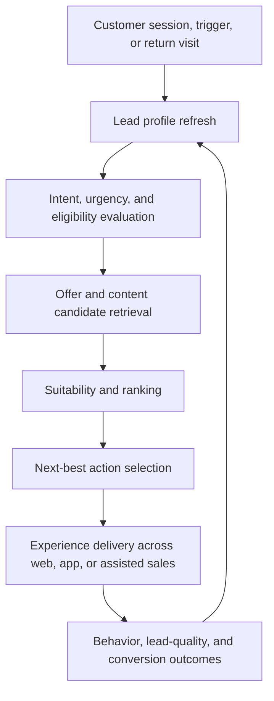
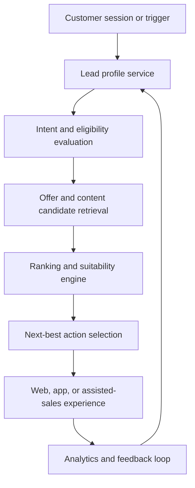

# Multi-Vertical Lead Generation Platform Overview

> **Navigation:** [Docs home](../../README.md#documentation-structure) | [Next: Customer State Model ->](./02-customer-state-model.md)

## Overview

This document frames the platform from a product and engineering perspective: **what problem it solves, why the architecture looks the way it does, and how it supports both new lead generation and returning-customer re-engagement**.

The platform is intended for service categories such as:

- novated leasing
- health insurance
- broadband
- other quote-led, callback-led, or application-led services

Across those verticals, the objective is consistent:

- understand what the customer is trying to do now
- determine what they are likely eligible and suitable for
- decide which offer, content, and CTA combination best fits the session
- improve the quality of downstream sales or provider handoff

---

## Business Goals

The platform should help the business:

- increase qualified lead volume
- improve conversion from visit to quote, callback, or application
- re-engage returning customers with more relevant journeys
- support multiple verticals without duplicating architecture and operating models
- align customer relevance with commercial priorities in a controlled way
- maintain explainable and auditable decisioning for operational confidence

These goals make the platform relevant beyond marketing optimization alone. It becomes a shared growth and operating capability.

---

## Platform Scope

The platform combines:

- customer profiles and journey states
- behavioral and contextual signals
- service and offer metadata
- deterministic ranking and suitability rules
- configurable campaign and provider priorities
- analytics and feedback loops
- AI-forward interpretation, retrieval, and explanation capabilities with deterministic guardrails

The reference implementation uses:

- .NET
- Azure
- Cosmos DB
- existing activity platform with attached metadata
- Azure OpenAI
- Azure AI Search

The architectural pattern matters more than the exact vendor choices.

---

## End-To-End Decisioning Flow

The loop matters because the platform should not treat conversion as a single-session event. It should support:

- first-time discovery
- mid-funnel return visits
- renewal or replacement journeys
- cross-sell or adjacent-service intent
- abandoned quote or application recovery

For a concrete walkthrough of how those steps work in one session, see [Worked Example: Returning Customer With Multiple Journeys](./worked-example/01-returning-customer-multi-journey.md).

---

## High-Level Architecture

Each stage exists to keep responsibilities clear:

- the **profile layer** maintains evolving customer state
- the **decisioning layer** evaluates what should happen now
- the **content and offer layer** supplies managed candidates
- the **experience layer** delivers recommendations in context
- the **analytics layer** measures whether the decision improved outcomes

---

## Why The Architecture Is Structured This Way

### 1. Customer State Must Persist Across Sessions

Service purchases are rarely one-click journeys. Customers compare, pause, return, switch products, and revisit when circumstances change.

That means the platform needs a persistent view of:

- interests
- research depth
- quote or application progress
- renewal timing
- prior service interactions
- known eligibility signals

### 2. Ranking Must Be Constrained By Suitability

The best-converting asset is not always the right asset to show. The system must filter and prioritize using:

- eligibility rules
- suitability rules
- campaign constraints
- provider capacity or commercial priorities
- channel and compliance constraints

### 3. Content Operations And Decisioning Should Not Be Coupled

Product and marketing teams need to manage offers, content, and metadata quickly. Engineering teams need stable, testable decisioning systems.

Separating those concerns allows:

- faster campaign and content iteration
- safer backend logic changes
- clearer governance and accountability

### 4. AI Should Improve Discovery, Not Own Policy

AI can help customers understand options and help the system retrieve useful information, but deterministic systems should remain authoritative for decisions that need to be explained, audited, or defended.

---

## Vertical-Aware Personalization Model

The same architecture should support multiple services through metadata and configuration.

Examples:

- **Novated leasing:** show EV tax-benefit guides, salary-packaging calculators, employer-eligibility prompts, and quote CTAs
- **Health insurance:** show cover comparisons, extras explainers, household-based guidance, and quote CTAs aligned to life stage
- **Broadband:** show speed guidance, provider comparisons, address-availability checks, and move-home or churn-support CTAs

The underlying platform logic stays consistent even when the visible experience changes by vertical.

---

## Core Principles

- personalization should be dynamic, session-aware, and resilient to changing customer intent
- decisioning should optimize for qualified conversion, not just engagement
- returning customers should be re-evaluated using prior context, not treated as blank sessions
- deterministic rules should handle eligibility, suitability, and campaign constraints before promotion
- AI should augment rather than replace business logic
- content and offer management should stay separate from ranking logic

---

## Recommended Delivery Approach

### Phase 1 - Decisioning Foundation

- customer profiles and journey states
- vertical-aware metadata model
- ranking with suitability guardrails
- initial analytics for lead quality and handoff outcomes

### Phase 2 - Behavioral And Analytics Optimization

- behavioral scoring
- returning-customer re-entry logic
- intent refinement
- lead-quality analytics by vertical and provider
- cross-vertical optimization loops

### Phase 3 - AI-Forward Experiences

- conversational guidance
- semantic retrieval
- AI-assisted summaries and query expansion
- richer recommendation explanation
- broader assisted-sales augmentation

---

| <- Previous | Next -> |
|---|---|
| [Documentation Home](../../README.md#documentation-structure) | [Customer State Model](./02-customer-state-model.md) |
