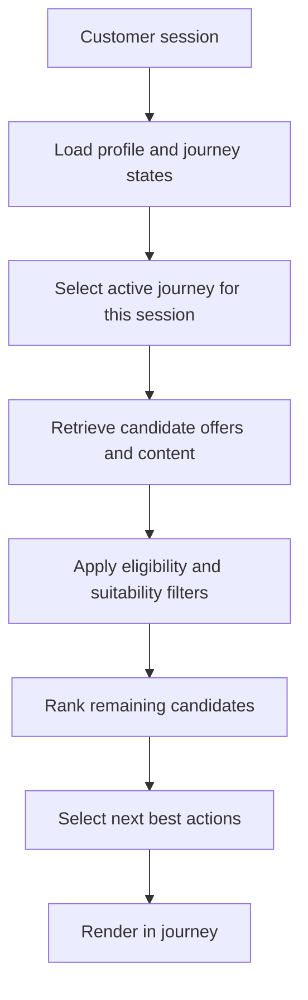

# Content Personalization Strategy

> **Navigation:** [Docs home](../../README.md#documentation-structure) | [Next: System Architecture ->](./04-system-architecture.md)

## Overview

This document defines how offers, educational content, tools, explanations, and CTAs are selected for each lead in a multi-vertical service platform.

The goal is not simply to recommend content. The goal is to:

> deliver the right offer, guidance, and next action for the most relevant current journey in a way that improves qualified conversion

In this architecture, personalization is a coordinated decision across:

- customer profile
- journey states
- business constraints
- managed metadata
- deterministic ranking
- AI-assisted interpretation and explanation

---

## Goals

The personalization layer should:

- match experiences to the most relevant active journey
- optimize for qualified lead outcomes such as quotes, applications, and callbacks
- support customers traversing multiple journeys at once
- account for eligibility, suitability, and regional availability
- combine metadata, behavior, and session context
- remain explainable and testable

---

## Core Personalization Model

Personalization is based on five inputs.

### 1. Customer Profile

Provided by the Customer Profile Service:

- household and employment attributes
- location and stable customer facts
- returning-customer summary
- cross-journey lead score

### 2. Journey States

Also provided by the Customer Profile Service:

- service category
- intent
- stage
- urgency
- resume status
- qualification state
- journey-level score

The platform may have multiple journey states for a customer, but it should select one as the primary driver for the current session.

### 3. Content And Offer Metadata

Provided by the CMS or offer catalog:

- service category
- subtype
- provider
- region
- eligibility rules reference
- conversion goal
- cta type
- compliance flags
- freshness
- priority

### 4. Context Signals

Real-time signals such as:

- session origin
- device type
- campaign source
- referral partner
- current session behavior
- assisted-sales versus self-serve journey type

### 5. Business Constraints

Deterministic rules such as:

- region restrictions
- serviceability checks
- provider suppression lists
- compliance guardrails
- campaign windows

---

## Personalization Flow

This makes the decisioning model explicit:

1. load the customer-level context
2. choose the journey that should lead the session
3. personalize around that journey while still allowing supporting cross-journey signals

---

## Active-Journey Selection

When multiple journeys exist, the platform should choose the active journey using:

- recency of meaningful events
- current session behavior
- campaign and channel context
- journey-level score
- qualification confidence
- whether the customer is resuming an interrupted flow

This avoids forcing the customer into a single permanent category while still keeping the current experience coherent.

---

## Candidate Selection Strategy

### Principle: Broad First, Narrow Later

The system should first retrieve a broad candidate set, then narrow through deterministic filtering and ranking.

Avoid overly restrictive CMS queries unless needed for hard constraints such as:

- expired offers
- unsupported regions
- missing compliance approval

### Filtering Dimensions

Initial filtering should include:

- active-journey category alignment
- funnel-stage compatibility
- region and provider availability
- basic eligibility and suitability checks

Cross-sell or secondary-journey candidates can still be included, but they should be intentionally positioned rather than mixed blindly into the primary journey set.

---

## Ranking Strategy Overview

Ranking determines final ordering of offers, content, and CTAs.

It is handled by the Ranking Engine, but relies on this strategy.

### Primary Ranking Signals

| Signal | Purpose |
|---|---|
| active-journey match | Align to the journey the platform should optimize now |
| intent alignment | Match the current customer need |
| eligibility fit | Prefer actions the lead can actually complete |
| funnel alignment | Match the current decision stage |
| behavioral relevance | Reflect recent actions and repeat interests |
| CTA alignment | Improve quote, callback, or application likelihood |
| provider or campaign priority | Support commercial objectives explicitly |
| freshness | Ensure current offers and guidance |

### Qualified Conversion Focus

Ranking is optimized for:

- quote starts
- quote completion
- application starts
- callback requests
- provider handoff success
- downstream qualified lead outcomes

---

## Content Metadata Strategy

### Required Metadata Model

All managed assets should include universal metadata.

| Field | Purpose |
|---|---|
| service_category | Lead vertical such as novated leasing, health insurance, or broadband |
| subtype | More specific classification inside a vertical |
| provider | Provider or partner association |
| region | Geographic availability |
| funnel_stage | Research, compare, quote, apply, renew, or resume |
| conversion_goal | Intended business outcome |
| cta_type | Quote, callback, compare, check eligibility, apply, resume |
| compliance_flags | Approval and disclosure requirements |
| freshness | Recency and validity relevance |
| priority | Explicit business control |

### Service-Specific Extensions

Verticals can extend the metadata model.

Examples:

- **Novated leasing:** vehicle type, employer requirement, tax-benefit angle
- **Health insurance:** cover tier, household fit, extras focus
- **Broadband:** speed tier, technology availability, contract type

---

## Personalization Dimensions

### 1. Journey Matching

Match assets based on:

- active journey category
- active journey intent
- active journey stage
- qualification and suitability state

### 2. Cross-Journey Support

When appropriate, the experience can also include:

- adjacent-service cross-sell prompts
- secondary-journey reminders
- lightweight exploration hooks for other active categories

### 3. Behavioral Alignment

Use observed behavior:

- viewed providers or plans
- repeated category visits
- quote or form abandonment
- calculator usage
- return frequency

### 4. Intent Alignment

Infer intent such as:

- exploring options
- comparing providers
- checking eligibility
- ready for quote
- ready to apply
- likely to switch

---

## Personalization Rules

### Rule 1: Relevance First

Candidates must pass basic relevance thresholds before ranking.

### Rule 2: Suitability Before Promotion

Do not promote offers or CTAs that fail deterministic suitability, eligibility, or compliance constraints.

### Rule 3: Active Journey Leads

The most relevant current journey should anchor the session experience.

### Rule 4: Cross-Journey Support Must Be Intentional

Secondary-journey content should support, not confuse, the primary path.

### Rule 5: Qualified Conversion Bias

When multiple items are similarly relevant:

> prefer the item most likely to produce a qualified lead outcome

### Rule 6: Diversity

Avoid showing:

- repeated providers
- duplicate CTA types
- overly similar assets in the same slot set

---

## AI Usage In Personalization

AI should help with:

- active-journey selection support
- intent inference
- content summarization
- explanation generation
- query expansion

AI must not be used for:

- hard ranking authority
- lead scoring authority
- business rule enforcement
- compliance overrides

---

## Performance Considerations

### Latency Target

Personalization should be designed for:

- fast session experiences
- cached candidate retrieval where possible
- precomputed profile and journey state

### Optimization Strategies

- cache CMS metadata with publish-aware invalidation
- precompute intent and engagement signals
- avoid heavy runtime calculations in ranking
- reuse candidate sets only when profile, journey, and content versions remain valid

---

## Summary

The Content Personalization Strategy defines how offers and content become relevant to each lead.

It connects:

- customer profile
- journey states
- content and offer metadata
- behavioral signals
- ranking logic

to deliver:

> dynamic, qualified-conversion-focused lead experiences at scale, even when customers are traversing multiple journeys

---

| <- Previous | Next -> |
|---|---|
| [Customer State Model](./02-customer-state-model.md) | [System Architecture](./04-system-architecture.md) |
