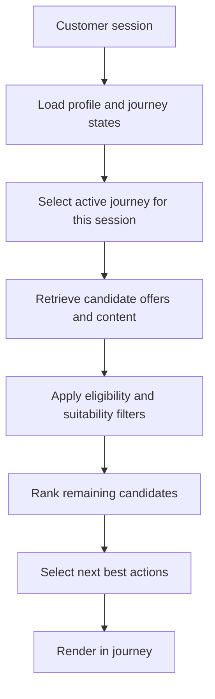

# Content Personalization Strategy

> **Navigation:** [Docs home](../../README.md#documentation-structure) | [Next: System Architecture ->](./04-system-architecture.md)

## Overview

This document defines how offers, educational content, tools, explanations, and CTAs are selected for each lead in a multi-vertical service platform.

The goal is not simply to recommend content. The goal is to:

> deliver the right offer, guidance, and next action for the most relevant current journey in a way that improves qualified conversion

In this architecture, personalization is a coordinated decision across:

- customer profile
- journey states
- business constraints
- activity metadata
- deterministic ranking
- AI-assisted interpretation and explanation

---

## Goals

The personalization layer should:

- match experiences to the most relevant active journey
- optimize for qualified lead outcomes such as quotes, applications, and callbacks
- support customers traversing multiple journeys at once
- account for eligibility, suitability, and regional availability
- combine metadata, behavior, and session context
- remain explainable and testable

---

## Personalization At A Glance

The top-level personalization flow is:

1. load customer profile and journey states
2. select the active journey for the session
3. retrieve a broad candidate set of activities, offers, content, tools, and CTAs
4. apply deterministic eligibility and suitability checks
5. rank what remains
6. return the next-best action and supporting experience

This keeps the architecture readable at the overview level while pushing the heavier detail into focused deep dives.

---

## How To Read This Section

Use this overview page for the high-level strategy, then go deeper based on what you need:

| Detail page | Best for | Covers |
|---|---|---|
| [Runtime Decisioning](./content-personalization-strategy/01-runtime-decisioning.md) | product + engineering | core personalization model, active-journey selection, candidate retrieval, and ranking flow |
| [Metadata and Rules](./content-personalization-strategy/02-metadata-and-rules.md) | product + content + engineering | activity metadata model, personalization dimensions, and decisioning rules |
| [AI, Edge Cases, and Performance](./content-personalization-strategy/03-ai-edge-cases-and-performance.md) | product + engineering | AI boundaries, conflict handling, fallback logic, and runtime performance guidance |
| [Illustrative Examples](./content-personalization-strategy/04-illustrative-examples.md) | product + content + delivery | novated-leasing progression examples and companion visuals |

---

## Summary

The content personalization strategy is the layer that turns customer state, journey state, activity metadata, and deterministic decisioning into one clear next-best experience.

The overview should stay simple:

- one active journey leads the session
- retrieval is broad before ranking narrows it
- deterministic controls stay authoritative
- AI supports interpretation and explanation
- supporting deep dives hold the heavier implementation detail

---

| <- Previous | Next -> |
|---|---|
| [Customer State Model](./02-customer-state-model.md) | [System Architecture](./04-system-architecture.md) |
