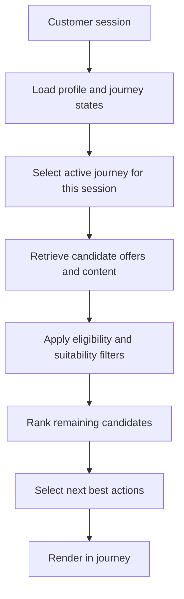

# Content Personalization Strategy

> **Navigation:** [Docs home](../../README.md#documentation-structure) | [Next: System Architecture ->](./04-system-architecture.md)

## Overview

This document defines how offers, educational content, tools, explanations, and CTAs are selected for each lead in a multi-vertical service platform.

The goal is not simply to recommend content. The goal is to:

> deliver the right offer, guidance, and next action for the most relevant current journey in a way that improves qualified conversion

In this architecture, personalization is a coordinated decision across:

- customer profile
- journey states
- business constraints
- managed metadata
- deterministic ranking
- AI-assisted interpretation and explanation

---

## Goals

The personalization layer should:

- match experiences to the most relevant active journey
- optimize for qualified lead outcomes such as quotes, applications, and callbacks
- support customers traversing multiple journeys at once
- account for eligibility, suitability, and regional availability
- combine metadata, behavior, and session context
- remain explainable and testable

---

## Core Personalization Model

Personalization is based on five inputs.

### 1. Customer Profile

Provided by the Customer Profile Service:

- household and employment attributes
- location and stable customer facts
- returning-customer summary
- cross-journey lead score

### 2. Journey States

Also provided by the Customer Profile Service:

- service category
- intent
- stage
- urgency
- resume status
- qualification state
- journey-level score

The platform may have multiple journey states for a customer, but it should select one as the primary driver for the current session.

### 3. Content And Offer Metadata

Provided by Contentful or the offer catalog:

- service category
- subtype
- provider
- region
- eligibility rules reference
- conversion goal
- cta type
- compliance flags
- freshness
- priority

### 4. Context Signals

Real-time signals such as:

- session origin
- device type
- campaign source
- referral partner
- current session behavior
- assisted-sales versus self-serve journey type

### 5. Business Constraints

Deterministic rules such as:

- region restrictions
- serviceability checks
- provider suppression lists
- compliance guardrails
- campaign windows

---

## Personalization Flow

This makes the decisioning model explicit:

1. load the customer-level context
2. choose the journey that should lead the session
3. personalize around that journey while still allowing supporting cross-journey signals

---

## Active-Journey Selection

When multiple journeys exist, the platform should choose the active journey using:

- recency of meaningful events
- current session behavior
- campaign and channel context
- journey-level score
- qualification confidence
- whether the customer is resuming an interrupted flow

This avoids forcing the customer into a single permanent category while still keeping the current experience coherent.

---

## Candidate Selection Strategy

### Principle: Broad First, Narrow Later

The system should first retrieve a broad candidate set, then narrow through deterministic filtering and ranking.

Avoid overly restrictive Contentful queries unless needed for hard constraints such as:

- expired offers
- unsupported regions
- missing compliance approval

### Filtering Dimensions

Initial filtering should include:

- active-journey category alignment
- funnel-stage compatibility
- region and provider availability
- basic eligibility and suitability checks

Cross-sell or secondary-journey candidates can still be included, but they should be intentionally positioned rather than mixed blindly into the primary journey set.

---

## Ranking Strategy Overview

Ranking determines final ordering of offers, content, and CTAs.

It is handled by the Ranking Engine, but relies on this strategy.

### Primary Ranking Signals

| Signal | Purpose |
|---|---|
| active-journey match | Align to the journey the platform should optimize now |
| intent alignment | Match the current customer need |
| eligibility fit | Prefer actions the lead can actually complete |
| funnel alignment | Match the current decision stage |
| behavioral relevance | Reflect recent actions and repeat interests |
| CTA alignment | Improve quote, callback, or application likelihood |
| provider or campaign priority | Support commercial objectives explicitly |
| freshness | Ensure current offers and guidance |

### Qualified Conversion Focus

Ranking is optimized for:

- quote starts
- quote completion
- application starts
- callback requests
- provider handoff success
- downstream qualified lead outcomes

---

## Content Metadata Strategy

### Required Metadata Model

All managed assets should include universal metadata.

| Field | Purpose |
|---|---|
| service_category | Lead vertical such as novated leasing, health insurance, or broadband |
| subtype | More specific classification inside a vertical |
| provider | Provider or partner association |
| region | Geographic availability |
| funnel_stage | Research, compare, quote, apply, renew, or resume |
| conversion_goal | Intended business outcome |
| cta_type | Quote, callback, compare, check eligibility, apply, resume |
| cta_deep_link | Deep-link destination the CTA should open for the selected journey and channel |
| compliance_flags | Approval and disclosure requirements |
| freshness | Recency and validity relevance |
| priority | Explicit business control |

### Service-Specific Extensions

Verticals can extend the metadata model.

Examples:

- **Novated leasing:** vehicle type, employer requirement, tax-benefit angle
- **Health insurance:** cover tier, household fit, extras focus
- **Broadband:** speed tier, technology availability, contract type

---

## Personalization Dimensions

### 1. Journey Matching

Match assets based on:

- active journey category
- active journey intent
- active journey stage
- qualification and suitability state

### 2. Cross-Journey Support

When appropriate, the experience can also include:

- adjacent-service cross-sell prompts
- secondary-journey reminders
- lightweight exploration hooks for other active categories

### 3. Behavioral Alignment

Use observed behavior:

- viewed providers or plans
- repeated category visits
- quote or form abandonment
- calculator usage
- return frequency

### 4. Intent Alignment

Infer intent such as:

- exploring options
- comparing providers
- checking eligibility
- ready for quote
- ready to apply
- likely to switch

---

## Personalization Rules

### Rule 1: Relevance First

Candidates must pass basic relevance thresholds before ranking.

### Rule 2: Suitability Before Promotion

Do not promote offers or CTAs that fail deterministic suitability, eligibility, or compliance constraints.

When a CTA is promoted, its deep link should also be validated for the active journey, channel, and region so the next step lands the customer in the intended flow rather than on a generic page.

### Rule 3: Active Journey Leads

The most relevant current journey should anchor the session experience.

### Rule 4: Cross-Journey Support Must Be Intentional

Secondary-journey content should support, not confuse, the primary path.

### Rule 5: Qualified Conversion Bias

When multiple items are similarly relevant:

> prefer the item most likely to produce a qualified lead outcome

### Rule 6: Diversity

Avoid showing:

- repeated providers
- duplicate CTA types
- overly similar assets in the same slot set

---

## AI Usage In Personalization

AI should help with:

- active-journey selection support
- intent inference
- content summarization
- explanation generation
- query expansion

AI must not be used for:

- hard ranking authority
- lead scoring authority
- business rule enforcement
- compliance overrides

---

## Edge Cases And Conflict Handling

The platform should be explicit about what happens when customer signals, campaign context, eligibility, and ranking pressure do not all point in the same direction.

This matters because many of the hardest personalization questions are really conflict-resolution questions.

### 1. Campaign Intent Conflicts With Customer History

Example:

- a customer arrives from a broadband campaign
- the customer also has a nearly complete health-insurance quote journey

Recommended behavior:

- use campaign context as an input, not an override
- evaluate recency, resume potential, current on-site behavior, and journey score
- choose one active journey for the session
- allow the non-leading journey to appear only as intentional secondary support

The platform should not blindly force the campaign category to lead if stronger customer-state evidence points elsewhere.

### 2. Multiple Journeys Are Simultaneously Plausible

Example:

- the customer has active broadband and health journeys
- both have recent activity
- current session behavior is mixed or weak

Recommended behavior:

- prefer the journey with the strongest combination of recency, qualification confidence, and next-step readiness
- keep the decision trace explicit so the result can be reviewed later
- surface the secondary journey only if it does not confuse the primary flow

When evidence is genuinely close, the system should still return one active journey rather than produce an incoherent mixed session.

### 3. A High-Priority Offer Is Not Suitable

Example:

- a provider or campaign has strong commercial priority
- the customer fails region, serviceability, or suitability checks

Recommended behavior:

- fail the candidate at deterministic filtering
- record the suppression reason
- do not allow commercial weighting to revive an ineligible or unsuitable result

Commercial priorities may reorder valid candidates, but they should not bypass protected constraints.

### 4. The Best Content Exists, But The Next Step Cannot Be Completed

Example:

- the content asset is relevant
- the CTA deep link does not match the active journey, channel, or region

Recommended behavior:

- treat CTA validity as part of suitability
- suppress or demote assets whose next step cannot land correctly
- prefer assets that move the customer into a valid, traceable flow

The platform should avoid showing a strong-looking recommendation that leads to a broken or generic destination.

### 5. Journey State Is Stale Or Incomplete

Example:

- the customer profile is known
- the most recent journey projection may lag the current session

Recommended behavior:

- use the latest committed projection in the live request path
- combine it with current session evidence
- tolerate bounded staleness rather than replaying raw history during the request
- emit telemetry that makes the final decision inspectable

The system should stay fast and explainable instead of trying to recompute everything synchronously.

### 6. AI Suggests A Different Interpretation Than Deterministic Signals

Example:

- AI suggests the customer should move into a different journey
- deterministic resume or qualification evidence points to another path

Recommended behavior:

- treat the AI result as decision support, not authority
- keep deterministic rules authoritative for protected decisions
- log both the AI suggestion and final selected outcome where useful

AI can help disambiguate intent, but it should not overrule deterministic evidence on its own.

### 7. No Strong Candidate Survives Filtering

Example:

- broad retrieval succeeds
- most or all candidates are suppressed by region, compliance, timing, or suitability constraints

Recommended behavior:

- return the best safe fallback set available
- prefer guidance, eligibility-check, callback, or resume actions over empty promotional slots
- avoid inventing recommendations that were not actually valid

The correct fallback is usually a safer next step, not a weaker version of the same invalid recommendation.

### 8. Secondary-Journey Support Starts To Pollute The Primary Path

Example:

- the system has valid cross-sell or secondary-journey items
- showing too many of them makes the current session harder to understand

Recommended behavior:

- cap the number and prominence of secondary-journey prompts
- keep the primary journey's next-best action dominant
- treat secondary support as optional and clearly labeled

Cross-journey support should expand opportunity without weakening session clarity.

### Summary Rule

When signals conflict, the platform should prefer:

1. deterministic safety and suitability
2. one clear active journey
3. the next step most likely to improve qualified conversion
4. explicit traceability for why the decision was made

That ordering keeps the system explainable even in ambiguous cases.

---

## Performance Considerations

### Latency Target

Personalization should be designed for:

- fast session experiences
- cached candidate retrieval where possible
- precomputed profile and journey state

### Optimization Strategies

- cache Contentful metadata with publish-aware invalidation
- precompute intent and engagement signals
- avoid heavy runtime calculations in ranking
- reuse candidate sets only when profile, journey, and content versions remain valid

---

## Illustrative Novated-Leasing Funnel Progression

The examples below show how the visible content mix should change as a novated-leasing journey moves toward qualified lead generation.

Each example uses a **2/3 experience panel** and a **1/3 metadata and decisioning panel** so product, content, and engineering readers can see both:

- what the customer sees
- which profile, metadata, AI support signals, and deterministic rules explain why it was matched

### 1. Research and Discovery

The first stage emphasizes education, calculator discovery, and low-friction guidance rather than pushing directly into a quote CTA.

### 2. Compare and Check Fit

Once the customer shows stronger intent, the experience should shift toward provider comparison, employer-fit guidance, and more explicit next-step CTAs.

### 3. Quote Ready and Lead Capture

When the journey becomes quote-ready, the lead-generation CTA can move to the primary position, supported by the correct deep link, disclosures, and proof points. The content surface should hand off into the quote journey rather than embed a form directly inside content.

### 4. Section-Labeled Wireframe View

This companion wireframe shows the same overall layout in a lower-fidelity format so the purpose of each section is easier to discuss in workshops or architecture reviews.

### 5. App-Style Experience Example

This companion example shows the same idea rendered more like a real app experience, with richer content cards, vehicle imagery, savings content, and a CTA that hands off into the quote journey.

This progression keeps the platform aligned to the core decisioning model:

1. broad candidate retrieval
2. active-journey and funnel-stage matching
3. deterministic eligibility, suitability, and compliance filtering
4. AI-supported interpretation and explanation
5. promotion of the most qualified next best action

---

## Summary

The Content Personalization Strategy defines how offers and content become relevant to each lead.

It connects:

- customer profile
- journey states
- content and offer metadata
- behavioral signals
- ranking logic

to deliver:

> dynamic, qualified-conversion-focused lead experiences at scale, even when customers are traversing multiple journeys

---

| <- Previous | Next -> |
|---|---|
| [Customer State Model](./02-customer-state-model.md) | [System Architecture](./04-system-architecture.md) |
