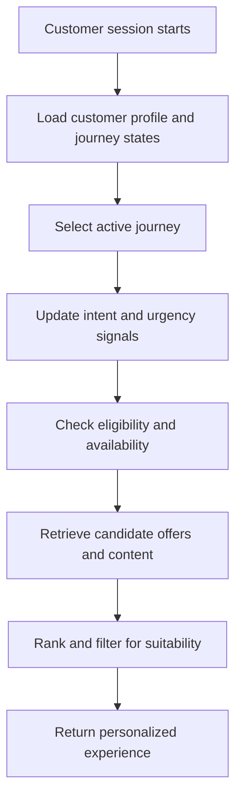

# System Architecture

> **Navigation:** [Docs home](../../README.md#documentation-structure) | [Next: Contentful Integration ->](../services/05-contentful-integration.md)

## Overview

This document defines the technical architecture for a multi-vertical lead-generation platform that personalizes offers and next-best actions across service categories.

The architecture assumes:

- one durable customer profile entity
- multiple concurrent journey states per customer
- an active-journey selection step during live decisioning

---

## Core Services

### Lead Profile Service

Responsibilities:

- maintain the durable customer profile
- aggregate behavioral and declared data
- maintain multiple journey states
- calculate customer-level and journey-level scores
- expose profile, journey, intent, and qualification views

Suggested technology:

- .NET
- Cosmos DB

---

### Personalization Service

Responsibilities:

- determine active service interest
- retrieve candidate offers and content
- coordinate eligibility and suitability checks
- compose the recommendation response

Suggested architecture:

- CQRS-friendly service boundaries
- isolated domain services per decisioning concern

---

### Ranking And Suitability Engine

Responsibilities:

- score candidate offers and CTAs
- enforce deterministic business constraints
- prioritize the next best actions
- explain why items were promoted or suppressed

---

### Contentful Adapter

Responsibilities:

- query managed content and offer metadata
- normalize CMS entities into domain models
- surface publish, expiry, and metadata changes to downstream services

Suggested implementation:

- GraphQL client
- infrastructure adapter layer

---

### Analytics And Feedback Pipeline

Responsibilities:

- collect interaction and conversion events
- build projections for lead quality and provider performance
- feed optimization signals back into the decisioning stack

---

## Suggested Runtime Topology

At implementation time, the platform can be split into a small number of clear runtime components.

| Component | Role | Typical interaction pattern |
|---|---|---|
| Experience orchestration API | Entry point for web, app, and assisted-sales channels | synchronous request/response |
| Customer profile service | Reads and updates customer profile and journey state | synchronous reads, asynchronous writes |
| Contentful adapter | Retrieves and normalizes managed assets | synchronous reads plus publish-driven invalidation |
| Ranking engine | Scores and orders candidates | synchronous in-request execution |
| Analytics pipeline | Processes behavior and outcome events | asynchronous event processing |
| AI interpretation layer | Supports journey interpretation, retrieval expansion, and explanations | synchronous for lightweight use cases, asynchronous for heavier enrichment |

This keeps the live request path small while allowing enrichment and analytics to scale independently.

---

## Session Flow



For session-triggered personalization, the profile and journey reads should use the latest committed projections, or a bounded-staleness equivalent with an explicit freshness target, before candidate retrieval and ranking continue.

---

## Implementation Notes For Live Requests

Recommended live request order:

1. load customer profile and currently active journey candidates
2. resolve the active journey for the session
3. retrieve candidate assets from normalized CMS-backed models
4. apply hard qualification and suitability checks
5. run ranking and slot-composition logic
6. optionally generate AI-supported explanation text
7. return the assembled response payload

Recommended latency discipline:

- keep the synchronous path limited to the orchestrator, profile read, retrieval, ranking, and lightweight AI calls
- move heavy analytics, replay, and non-critical enrichment off the request thread
- prefer precomputed projections over repeated raw event scans

---

## Suggested Service Contracts

The docs do not need to prescribe final API shapes, but a concrete contract model helps make the architecture implementable.

| Interaction | Suggested shape | Notes |
|---|---|---|
| Channel -> Orchestrator | `POST /personalization/resolve` | includes customer identity, session context, and optional query text |
| Orchestrator -> Profile service | `GET /customers/{id}` and `GET /customers/{id}/journeys` | read current profile and candidate journeys |
| Orchestrator -> Content adapter | `POST /content/query` | request broad candidate set by active-journey context |
| Orchestrator -> Ranking engine | `POST /ranking/score` | pass profile, active journey, candidates, and context |
| Channel -> Event collection | `POST /events` | emit behavior, impression, and outcome events asynchronously |

Example orchestration request:

```json
{
  "customerId": "12345",
  "sessionId": "session-001",
  "channel": "web",
  "entryPoint": "paid_search",
  "currentUrl": "/health-insurance/compare",
  "queryText": "family cover with extras",
  "region": "NSW"
}
```

---

## Service Boundaries

### Profile Domain

Owns:

- customer identity linkage
- stable customer facts
- customer-level lead score
- customer-level return behavior summaries

### Journey Domain

Owns:

- service-specific journey states
- journey intent and stage projections
- journey qualification evidence
- resume and renewal indicators
- journey-level scores

### Decisioning Domain

Owns:

- active-journey selection
- candidate retrieval
- ranking
- suitability constraints
- campaign priority handling
- next-best-action assembly

### Content Domain

Owns:

- managed copy
- provider and offer metadata
- disclosure content
- lifecycle status of content assets

### Analytics Domain

Owns:

- event history
- optimization projections
- funnel reporting
- experiment measurement

---

## Data And State Placement

Recommended state placement:

| State | Primary owner | Why |
|---|---|---|
| Durable customer facts | Profile domain | reused across all journeys |
| Service-specific journey state | Journey domain | changes faster and needs independent progression |
| Managed content and offers | Content domain | editorial and campaign governance |
| Ranking configuration | Decisioning domain | operational control and explainability |
| Historical event stream | Analytics domain / event infrastructure | replay and measurement |

This keeps storage decisions aligned with service ownership.

---

## Architectural Principles

- keep business logic server-side
- keep rendering channels lightweight
- separate profile, journey, and decisioning concerns
- separate qualification from presentation
- make suitability and compliance rules explicit
- support asynchronous analytics processing
- enable vertical rollout through configuration, not cloned services

---

| <- Previous | Next -> |
|---|---|
| [Content Personalization Strategy](./03-content-personalization-strategy.md) | [Contentful Integration](../services/05-contentful-integration.md) |
