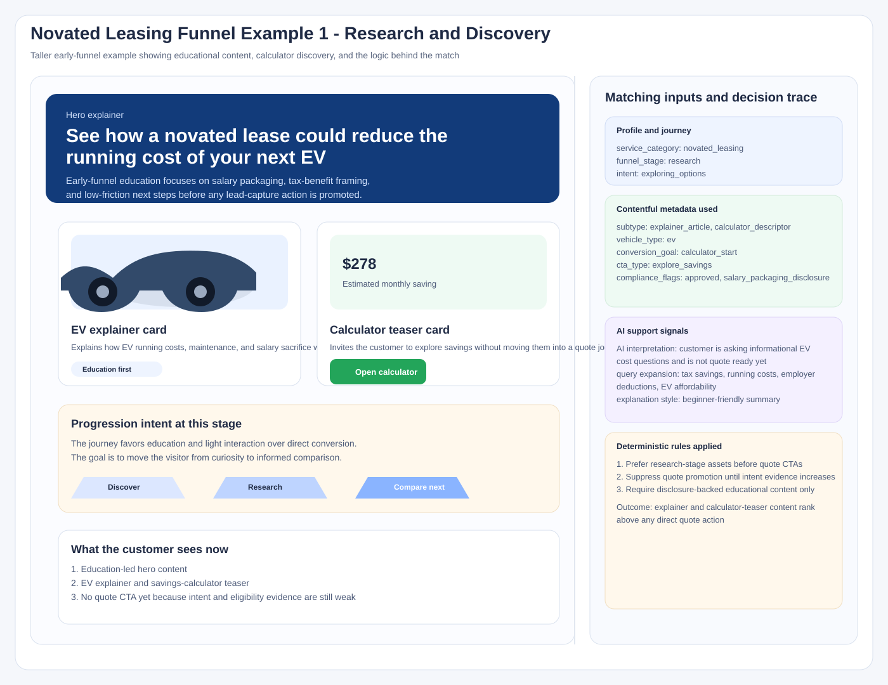
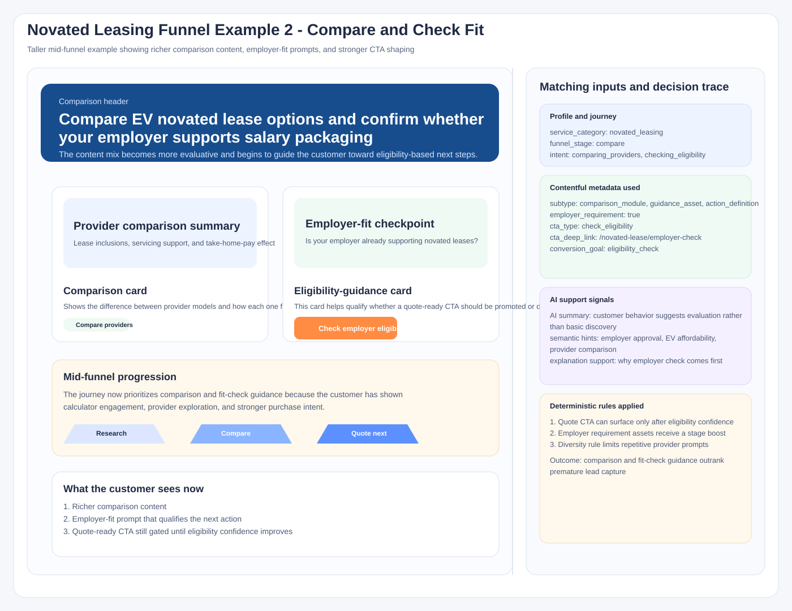
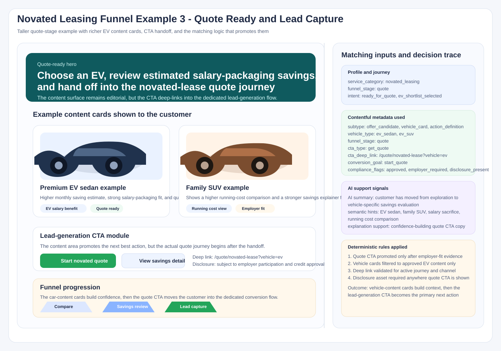
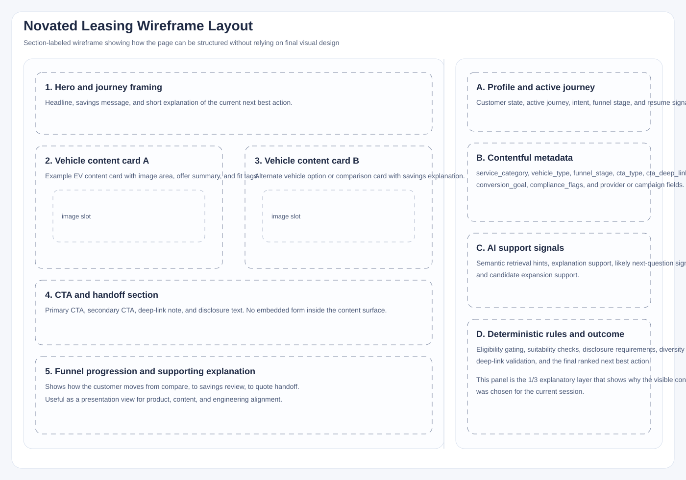
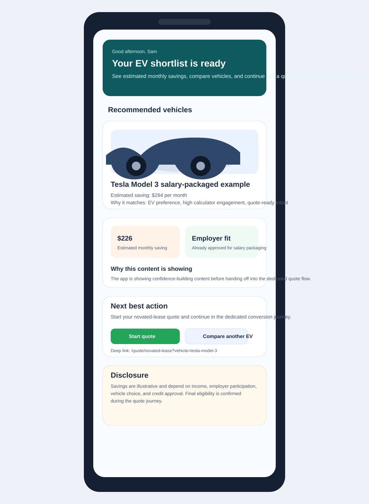

# Illustrative Examples

> **Navigation:** [Docs home](../../../README.md#documentation-structure) | [Parent: Content Personalization Strategy](../03-content-personalization-strategy.md) | [Previous: AI, Edge Cases, and Performance <-](./03-ai-edge-cases-and-performance.md)

## Overview

These examples show how the visible content mix should change as a novated-leasing journey moves toward qualified lead generation.

Each example uses a **2/3 experience panel** and a **1/3 metadata and decisioning panel** so product, content, and engineering readers can see both:

- what the customer sees
- which profile, metadata, AI support signals, and deterministic rules explain why it was matched

---

## 1. Research and Discovery

The first stage emphasizes education, calculator discovery, and low-friction guidance rather than pushing directly into a quote CTA.

## 2. Compare and Check Fit

Once the customer shows stronger intent, the experience should shift toward provider comparison, employer-fit guidance, and more explicit next-step CTAs.

## 3. Quote Ready and Lead Capture

When the journey becomes quote-ready, the lead-generation CTA can move to the primary position, supported by the correct deep link, disclosures, and proof points. The content surface should hand off into the quote journey rather than embed a form directly inside content.

## 4. Section-Labeled Wireframe View

This companion wireframe shows the same overall layout in a lower-fidelity format so the purpose of each section is easier to discuss in workshops or architecture reviews.

## 5. App-Style Experience Example

This companion example shows the same idea rendered more like a real app experience, with richer content cards, vehicle imagery, savings content, and a CTA that hands off into the quote journey.

This progression keeps the platform aligned to the core decisioning model:

1. broad candidate retrieval
2. active-journey and funnel-stage matching
3. deterministic eligibility, suitability, and compliance filtering
4. AI-supported interpretation and explanation
5. promotion of the most qualified next best action

---

## Summary

These examples are presentation aids for the personalization strategy. They show how the same decisioning model can produce visibly different experiences as the customer moves deeper into a journey.

---

| <- Previous | Next -> |
|---|---|
| [AI, Edge Cases, and Performance](./03-ai-edge-cases-and-performance.md) | [Documentation Home](../../../README.md#documentation-structure) |
