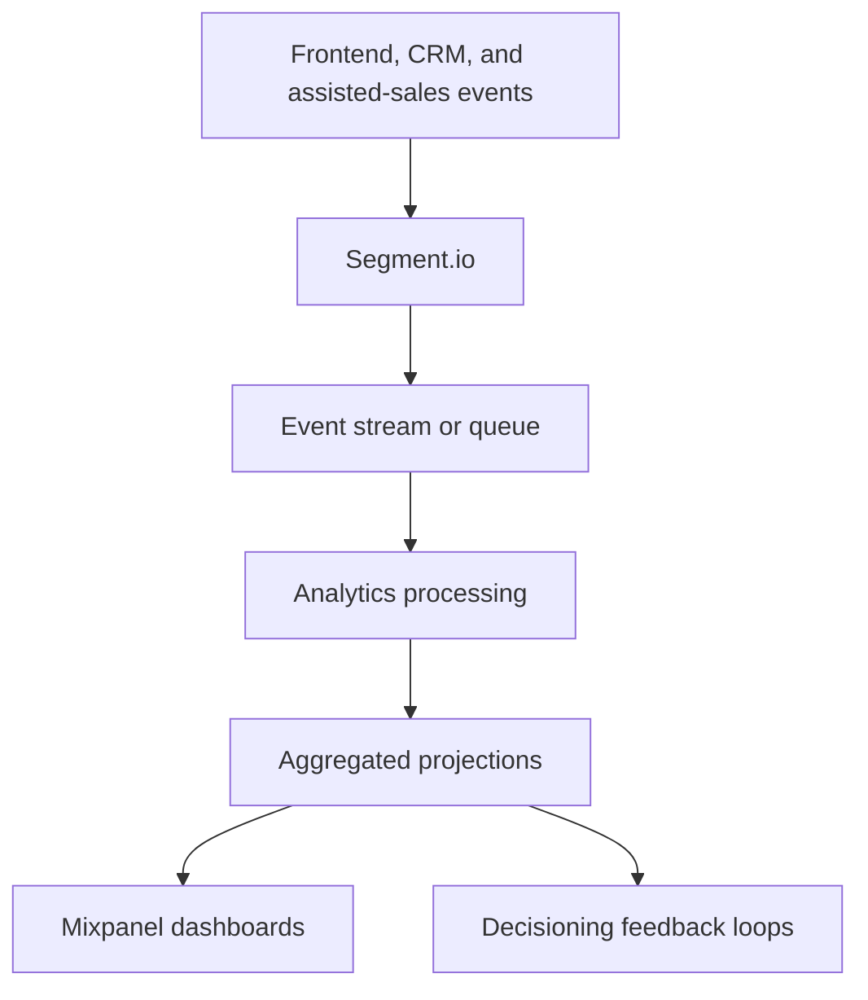

# Feedback and Analytics

> **Navigation:** [Docs home](../../README.md#documentation-structure) | [Next: Delivery Roadmap ->](../delivery/11-roadmap.md)

## Overview

Behavioral feedback and analytics are critical for improving lead quality and personalization effectiveness over time.

The platform should continuously measure:

- engagement
- qualification behavior
- active-journey selection quality
- ranking effectiveness
- AI-assisted experience quality
- progression toward quote, application, and provider handoff

Analytics should be treated as a core platform capability rather than a secondary concern.

---

## Goals

The analytics platform should support:

- personalization optimization
- ranking improvements
- lead-scoring refinement
- active-journey refinement
- conversion analysis
- experimentation
- behavioral understanding
- customer and journey analysis

---

## Who Should Read This

| Audience | Why this page matters |
|---|---|
| Marketing and growth | understand what business outcomes and dashboards matter |
| Product and delivery | understand the measurement model and governance expectations |
| Engineering and data | understand where telemetry, event models, and decision traces fit |

---

## Analytics Architecture At A Glance

---

## What This Capability Must Deliver

- measurement of qualified conversion, not just engagement
- journey-aware telemetry through Segment.io
- decision traceability for recommendations, suppression, and AI assistance
- Mixpanel dashboards that reflect journeys and decision quality
- analytics outputs that support safer optimization

---

## Recommended Technologies

| Capability | Suggested Technology |
|---|---|
| Telemetry collection | Segment.io |
| Event ingestion backbone | Azure Event Hubs |
| Queue processing | Azure Service Bus |
| Stream processing | Azure Functions |
| Operational storage | Cosmos DB |
| Analytical storage | Data Lake / Synapse |
| Dashboarding | Mixpanel |
| Deep reporting | Power BI |

---

## How To Read This Section

Use the overview page for orientation, then go deeper based on what you need:

| Detail page | Best for | Covers |
|---|---|---|
| [Success Measurement](./feedback-and-analytics/01-success-measurement.md) | marketing + product + analytics | outcome model, guardrails, ownership, and what changes make success easy to measure |
| [Event Model and Dashboards](./feedback-and-analytics/02-event-model-and-dashboards.md) | engineering + analytics | signals, event taxonomy, Segment-to-Mixpanel flow, dashboard definitions, and projections |

---

## What Business Readers Should Take Away

- measurement should prove qualified conversion and journey quality, not just click volume
- dashboards should be organized around decisions and outcomes
- ownership for metrics, telemetry quality, and experiment readouts should be explicit

## What Engineering And Data Readers Should Take Away

- analytics must be designed into the platform rather than bolted on later
- decision traces, versioning, and stable identifiers are required for trustworthy attribution
- the telemetry path should support both fast reporting and deeper optimization loops

---

## Summary

Analytics should help the platform maximize qualified lead outcomes while preserving explainability.

The platform should prioritize:

- structured events
- journey-aware measurement
- asynchronous processing
- replayable history
- explainable metrics
- continuous optimization

---

| <- Previous | Next -> |
|---|---|
| [Vector Search Design](../ai/09-vector-search-design.md) | [Delivery Roadmap](../delivery/11-roadmap.md) |
