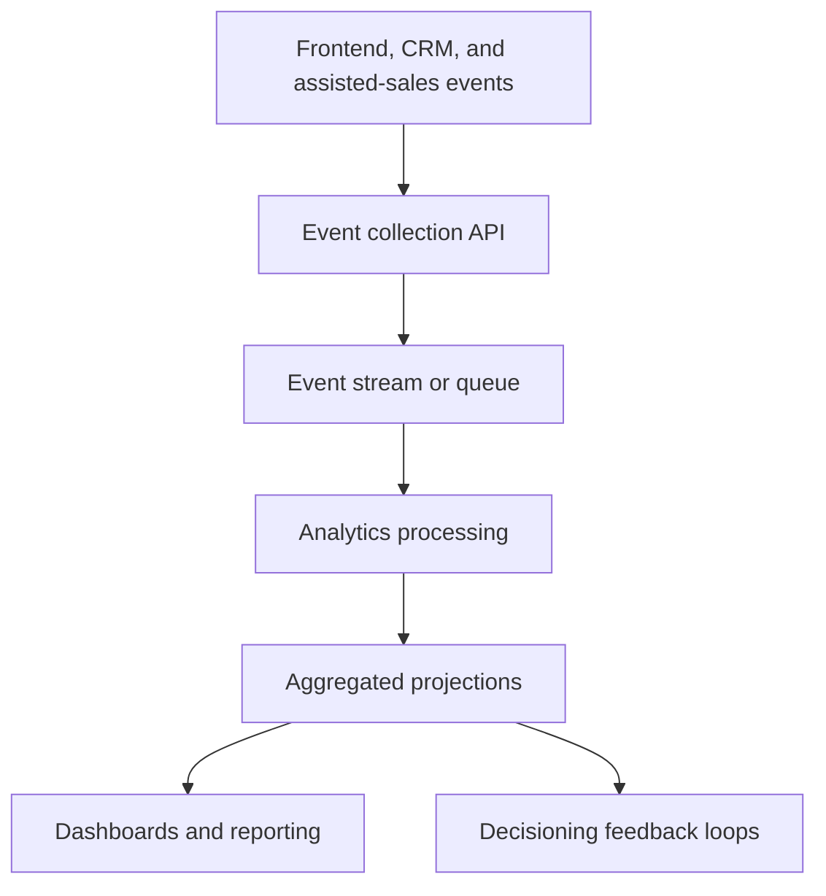

# Feedback and Analytics

> **Navigation:** [Docs home](../../README.md#documentation-structure) | [Next: Delivery Roadmap ->](../delivery/11-roadmap.md)

## Overview

Behavioral feedback and analytics are critical for improving lead quality and personalization effectiveness over time.

The platform should continuously measure:

- engagement
- qualification behavior
- active-journey selection quality
- ranking effectiveness
- AI-assisted experience quality
- progression toward quote, application, and provider handoff

Analytics should be treated as a core platform capability rather than a secondary concern.

---

## Goals

The analytics platform should support:

- personalization optimization
- ranking improvements
- lead-scoring refinement
- active-journey refinement
- conversion analysis
- experimentation
- behavioral understanding
- customer and journey analysis

---

## Core Principles

### Collect Structured Events

All behavioral events should follow consistent schemas.

This enables:

- replayability
- analytics projections
- future model training
- experimentation
- debugging

### Separate Operational And Analytical Concerns

Operational systems should remain optimized for:

- personalization
- responsiveness
- low latency

Analytics systems should focus on:

- aggregation
- reporting
- optimization
- historical analysis

### Process Analytics Asynchronously

Analytics processing should not slow down:

- session flows
- candidate retrieval
- ranking
- personalization responses

Use asynchronous event pipelines wherever possible.

---

## Recommended Signals

### Engagement Signals

Track:

- content impressions
- clicks
- session duration
- repeated visits
- calculator usage
- form starts

### Qualification Signals

Track:

- eligibility checks
- serviceability results
- provider comparison depth
- contact preference selections
- renewal timing

### Conversion Signals

Track:

- quote starts
- quote completion
- application starts
- callback requests
- provider handoff completion
- downstream activation proxies

### Personalization Signals

Track:

- recommended assets shown
- recommendation clicks
- recommendation dismissal
- recommendation effectiveness
- personalization confidence

### AI Signals

Track:

- AI explanation shown
- AI explanation clicked or expanded
- conversational assist usage
- AI-supported journey selection outcome
- retrieval grounding quality indicators

---

## Recommended Event Model

Example event structure:

```json
{
  "eventType": "quote_started",
  "customerId": "12345",
  "journeyId": "journey-broadband-001",
  "timestamp": "2026-05-11T12:00:00Z",
  "sessionId": "session-001",
  "metadata": {
    "serviceCategory": "broadband",
    "provider": "Provider A",
    "funnelStage": "quote",
    "region": "NSW",
    "activeJourneySelected": true
  }
}
```

Including `journeyId` is important once the platform supports multiple concurrent journeys.

---

## Suggested Event Taxonomy

Implementation becomes easier if events are grouped by purpose.

| Event family | Examples | Primary use |
|---|---|---|
| impression events | `asset_impression`, `cta_impression` | view and slot measurement |
| interaction events | `asset_click`, `calculator_started`, `conversation_opened` | engagement analysis |
| qualification events | `eligibility_checked`, `serviceability_checked` | suitability and drop-off analysis |
| conversion events | `quote_started`, `quote_completed`, `callback_requested` | lead-quality and funnel analysis |
| decision trace events | `active_journey_selected`, `recommendation_served` | personalization debugging and optimization |

This taxonomy helps engineering and analytics teams agree on event ownership.

---

## Recommended Analytics Architecture



---

## Decision Trace Detail

To support explainability, the platform should emit lightweight decision-trace events.

Example:

```json
{
  "eventType": "recommendation_served",
  "customerId": "12345",
  "journeyId": "journey-health-001",
  "sessionId": "session-001",
  "metadata": {
    "activeJourney": "health_insurance",
    "topRecommendation": "offer-123",
    "rankingPolicyVersion": "health-v3",
    "contentRevision": "offer-123@17"
  }
}
```

This is especially useful when product or engineering want to understand why a session resolved the way it did.

---

## Recommended Technologies

| Capability | Suggested Technology |
|---|---|
| Event ingestion | Azure Event Hubs |
| Queue processing | Azure Service Bus |
| Stream processing | Azure Functions |
| Operational storage | Cosmos DB |
| Analytical storage | Data Lake / Synapse |
| Visualization | Power BI |

---

## Feedback Into Decisioning

The analytics stack should produce inputs that are operationally useful, not just reportable.

Recommended feedback outputs:

- active-journey selection quality by scenario
- provider performance by journey stage
- CTA effectiveness by vertical
- ranking weight review candidates
- AI explanation performance metrics

These outputs should feed configuration review and future model tuning, not directly overwrite live decision logic.

---

## Analytics Projections

Recommended projections include:

| Projection | Purpose |
|---|---|
| customer_engagement | Engagement scoring |
| journey_performance | Journey-specific conversion and drop-off analysis |
| qualified_lead_score | Lead-quality measurement |
| provider_performance | Partner and provider optimization |
| conversion_funnel | Funnel analysis |
| personalization_effectiveness | Recommendation quality |
| ai_experience_effectiveness | AI-assisted experience quality |

---

## What The Platform Should Measure

### Performance Analysis

Measure:

- quote rate by service category
- quote completion by provider
- callback rate by journey type
- conversion rate by CTA
- eligibility drop-off points
- campaign effectiveness

### Journey Analysis

Evaluate:

- which journey was selected as active
- whether that journey was the right one in hindsight
- when secondary journeys should have been surfaced
- where returning customers resume or abandon

### Personalization Effectiveness

Evaluate:

- recommendation relevance
- engagement uplift
- personalization accuracy
- conversion influence
- ranking quality

Suggested comparisons:

- personalized versus non-personalized experiences
- deterministic versus AI-assisted experiences
- ranking strategy comparisons by vertical
- single-journey versus multi-journey presentation strategies

---

## Funnel Analytics

Track customer movement through:

```text
Research
    ↓
Compare
    ↓
Check Eligibility
    ↓
Quote / Callback
    ↓
Apply / Handoff
```

Measure:

- progression speed
- abandonment points
- conversion bottlenecks
- high-performing journeys

---

## Experimentation Support

The analytics platform should support:

- A/B testing
- ranking experiments
- provider mix experiments
- vertical-specific journey tests
- AI explanation and conversational experiments

---

## Summary

Analytics should help the platform maximize qualified lead outcomes while preserving explainability.

The platform should prioritize:

- structured events
- journey-aware measurement
- asynchronous processing
- replayable history
- explainable metrics
- continuous optimization

---

| <- Previous | Next -> |
|---|---|
| [Vector Search Design](../ai/09-vector-search-design.md) | [Delivery Roadmap](../delivery/11-roadmap.md) |
