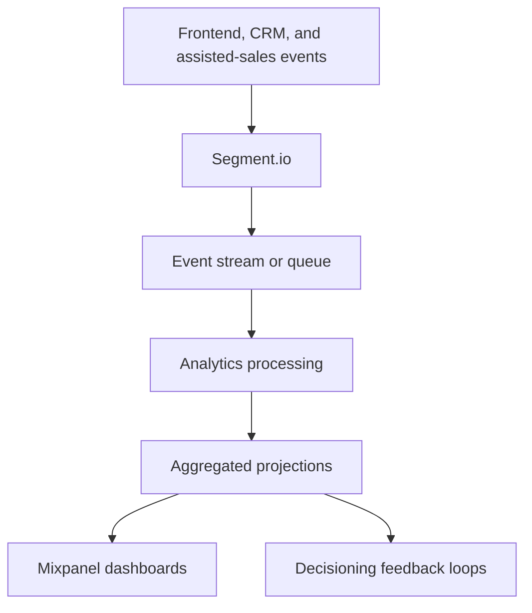
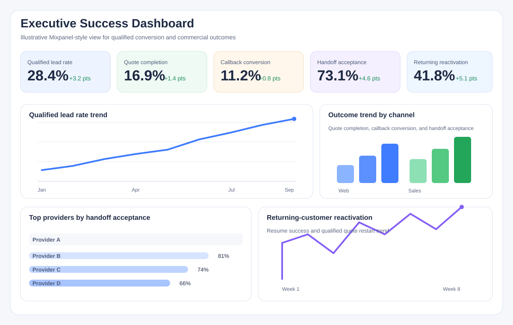
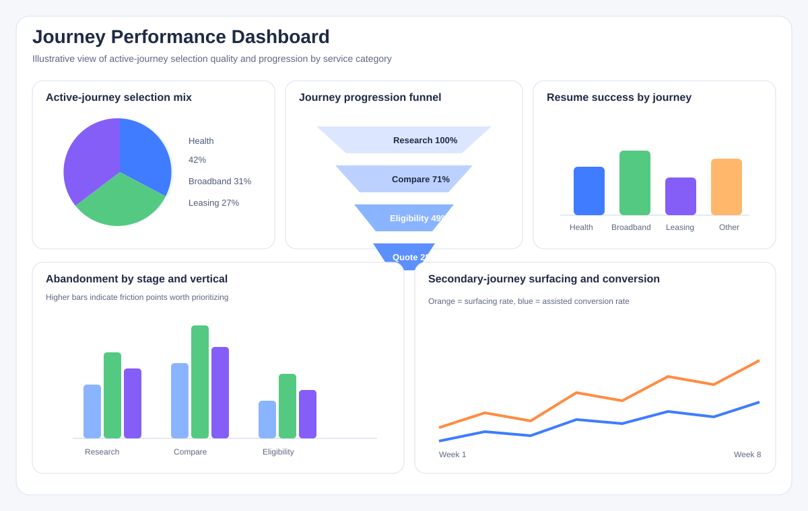
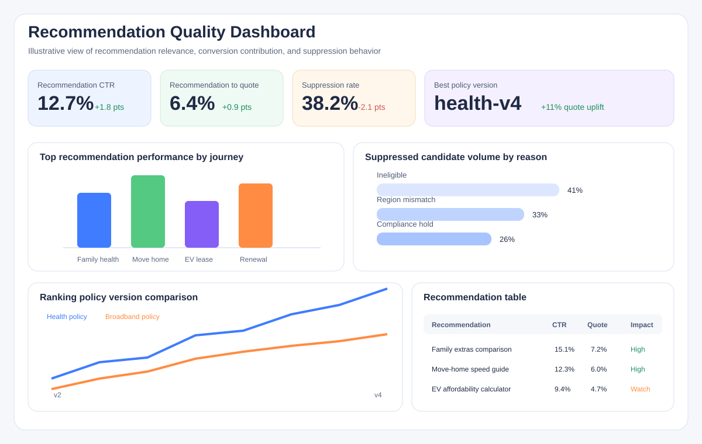
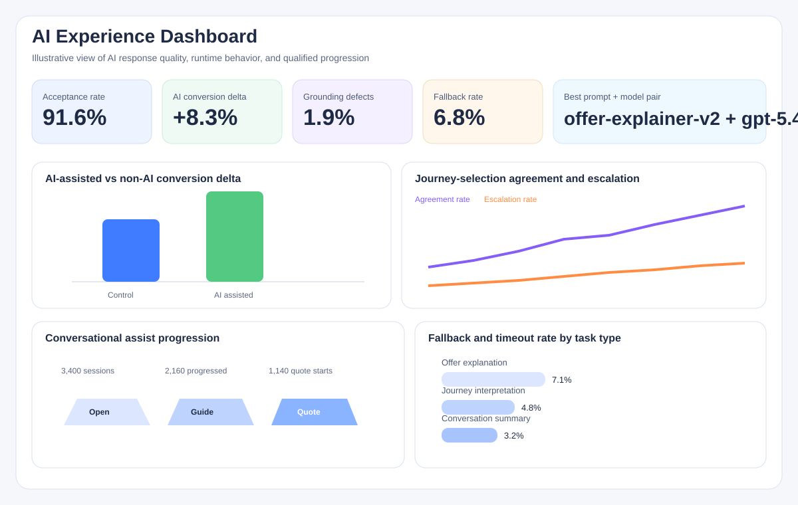
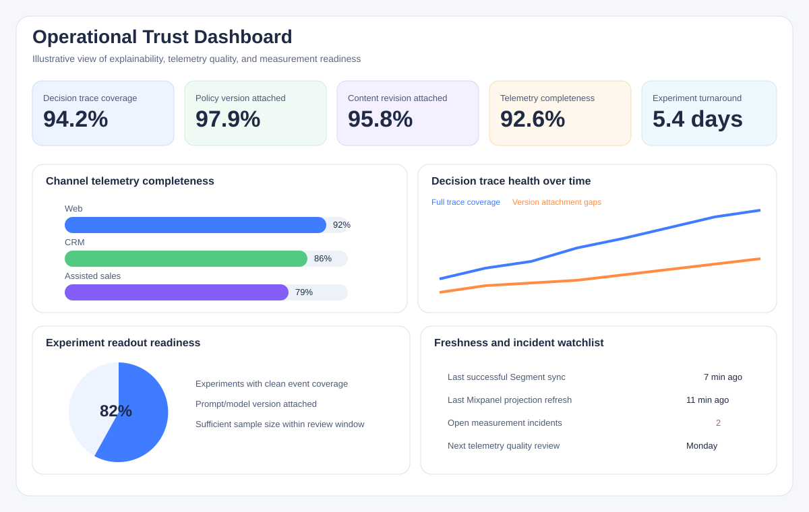

# Feedback and Analytics: Event Model and Dashboards

> **Navigation:** [Docs home](../../../README.md#documentation-structure) | [Parent: Feedback and Analytics](../10-feedback-and-analytics.md) | [Previous: Success Measurement <-](./01-success-measurement.md)

## Overview

This document covers the event model, analytics architecture, dashboard definitions, and projections that support personalization optimization.

---

## Core Principles

### Collect Structured Events

All behavioral events should follow consistent schemas.

This enables:

- replayability
- analytics projections
- future model training
- experimentation
- debugging

### Separate Operational And Analytical Concerns

Operational systems should remain optimized for:

- personalization
- responsiveness
- low latency

Analytics systems should focus on:

- aggregation
- reporting
- optimization
- historical analysis

### Process Analytics Asynchronously

Analytics processing should not slow down:

- session flows
- candidate retrieval
- ranking
- personalization responses

Use asynchronous event pipelines wherever possible.

---

## Recommended Signals

### Engagement Signals

Track:

- content impressions
- clicks
- session duration
- repeated visits
- calculator usage
- form starts

### Qualification Signals

Track:

- eligibility checks
- serviceability results
- provider comparison depth
- contact preference selections
- renewal timing

### Conversion Signals

Track:

- quote starts
- quote completion
- application starts
- callback requests
- provider handoff completion
- downstream activation proxies

### Personalization Signals

Track:

- recommended assets shown
- recommendation clicks
- recommendation dismissal
- recommendation effectiveness
- personalization confidence

### AI Signals

Track:

- AI explanation shown
- AI explanation clicked or expanded
- conversational assist usage
- AI-supported journey selection outcome
- retrieval grounding quality indicators
- AI response accepted, rejected, or replaced with fallback
- unsupported-claim or disclosure defect indicators
- CTA progression after AI response

---

## Recommended Event Model

Example event structure:

```json
{
  "eventType": "quote_started",
  "customerId": "12345",
  "journeyId": "journey-broadband-001",
  "timestamp": "2026-05-11T12:00:00Z",
  "sessionId": "session-001",
  "metadata": {
    "serviceCategory": "broadband",
    "provider": "Provider A",
    "funnelStage": "quote",
    "region": "NSW",
    "activeJourneySelected": true
  }
}
```

Including `journeyId` is important once the platform supports multiple concurrent journeys.

### Suggested Event Taxonomy

Implementation becomes easier if events are grouped by purpose.

| Event family | Examples | Primary use |
|---|---|---|
| impression events | `asset_impression`, `cta_impression` | view and slot measurement |
| interaction events | `asset_click`, `calculator_started`, `conversation_opened` | engagement analysis |
| qualification events | `eligibility_checked`, `serviceability_checked` | suitability and drop-off analysis |
| conversion events | `quote_started`, `quote_completed`, `callback_requested` | lead-quality and funnel analysis |
| decision trace events | `active_journey_selected`, `recommendation_served` | personalization debugging and optimization |
| AI trace events | `ai_response_generated`, `ai_response_accepted`, `ai_response_rejected`, `ai_fallback_served` | AI quality, safety, and runtime analysis |

This taxonomy helps engineering and analytics teams agree on event ownership.

### AI Trace Detail

AI should emit its own lightweight trace events so teams can inspect response quality without scraping free-form logs.

Example:

```json
{
  "eventType": "ai_response_accepted",
  "customerId": "12345",
  "journeyId": "journey-health-001",
  "sessionId": "session-001",
  "metadata": {
    "responseId": "air-001",
    "aiTaskType": "offer_explanation",
    "serviceCategory": "health_insurance",
    "modelVersion": "gpt-5.4",
    "promptTemplateVersion": "offer-explainer-v2",
    "groundingAssetIds": [
      "offer-health-family-001",
      "faq-health-extras-003"
    ],
    "accepted": true,
    "fallbackUsed": false,
    "latencyMs": 840,
    "ctaId": "start-quote"
  }
}
```

Recommended fields for AI trace events:

- response ID
- AI task type
- prompt template version
- model version
- grounding asset IDs
- acceptance or rejection outcome
- fallback reason where applicable
- latency and timeout outcome
- CTA or next-step identifier
- experiment assignment

### Decision Trace Detail

To support explainability, the platform should emit lightweight decision-trace events.

Example:

```json
{
  "eventType": "recommendation_served",
  "customerId": "12345",
  "journeyId": "journey-health-001",
  "sessionId": "session-001",
  "metadata": {
    "activeJourney": "health_insurance",
    "topRecommendation": "offer-123",
    "rankingPolicyVersion": "health-v3",
    "contentRevision": "offer-123@17"
  }
}
```

This is especially useful when product or engineering want to understand why a session resolved the way it did.

---

## Recommended Analytics Architecture



### Recommended Technologies

| Capability | Suggested Technology |
|---|---|
| Telemetry collection | Segment.io |
| Event ingestion backbone | Azure Event Hubs |
| Queue processing | Azure Service Bus |
| Stream processing | Azure Functions |
| Operational storage | Cosmos DB |
| Analytical storage | Data Lake / Synapse |
| Dashboarding | Mixpanel |
| Deep reporting | Power BI |

---

## Dashboard Views For Success

Mixpanel should provide a small set of opinionated dashboards that make platform success easy to inspect.

### 1. Executive Success Dashboard

Purpose:

- show whether the platform is improving qualified business outcomes

Recommended panels:

- qualified lead rate trend
- quote completion trend
- callback conversion trend
- provider handoff acceptance trend
- returning-customer reactivation rate

Illustrative mockup:



### 2. Journey Performance Dashboard

Purpose:

- show whether the right journeys are being selected and advanced

Recommended panels:

- active-journey selection by category
- journey progression funnel by service category
- resume success rate for returning journeys
- abandonment rate by stage
- secondary-journey surfacing rate

Illustrative mockup:



### 3. Recommendation Quality Dashboard

Purpose:

- show whether recommendations are helping or hurting conversion quality

Recommended panels:

- recommendation click-through rate
- recommendation-to-quote rate
- top recommendation performance by journey
- suppressed candidate volume by reason
- ranking policy version comparison

Illustrative mockup:



### 4. AI Experience Dashboard

Purpose:

- show where AI is adding value

Recommended panels:

- AI explanation engagement rate
- AI-assisted versus non-AI conversion delta
- AI-supported journey selection quality
- conversational assist usage and progression
- grounded-response issue or escalation rate
- AI response acceptance rate
- fallback and timeout rate by AI task type
- AI outcome comparison by prompt and model version

Illustrative mockup:



### 5. Operational Trust Dashboard

Purpose:

- show whether the platform is explainable and measurable enough to optimize safely

Recommended panels:

- sessions with full decision trace
- sessions with ranking policy version attached
- sessions with content revision attached
- telemetry completeness by channel
- experiment readout turnaround time

Illustrative mockup:



---

## Analytics Projections

Recommended projections include:

| Projection | Purpose |
|---|---|
| customer_engagement | Engagement scoring |
| journey_performance | Journey-specific conversion and drop-off analysis |
| qualified_lead_score | Lead-quality measurement |
| provider_performance | Partner and provider optimization |
| conversion_funnel | Funnel analysis |
| personalization_effectiveness | Recommendation quality |
| ai_experience_effectiveness | AI-assisted experience quality |

---

## What The Platform Should Measure

### Performance Analysis

Measure:

- quote rate by service category
- quote completion by provider
- callback rate by journey type
- conversion rate by CTA
- eligibility drop-off points
- campaign effectiveness

### Journey Analysis

Evaluate:

- which journey was selected as active
- whether that journey was the right one in hindsight
- when secondary journeys should have been surfaced
- where returning customers resume or abandon

### Personalization Effectiveness

Evaluate:

- recommendation relevance
- engagement uplift
- personalization accuracy
- conversion influence
- ranking quality

### AI Response Effectiveness

Evaluate:

- whether responses were accepted or rejected before display
- whether grounded answers progress customers to a meaningful CTA
- which prompt or model versions create the best qualified outcomes
- where fallback logic is protecting the experience
- whether AI adds value beyond deterministic explanations

Suggested comparisons:

- personalized versus non-personalized experiences
- deterministic versus AI-assisted experiences
- ranking strategy comparisons by vertical
- single-journey versus multi-journey presentation strategies

---

## Funnel Analytics

Track customer movement through:

```text
Research
    ↓
Compare
    ↓
Check Eligibility
    ↓
Quote / Callback
    ↓
Apply / Handoff
```

Measure:

- progression speed
- abandonment points
- conversion bottlenecks
- high-performing journeys

---

## Experimentation Support

The analytics platform should support:

- A/B testing
- ranking experiments
- provider mix experiments
- vertical-specific journey tests
- AI explanation and conversational experiments

---

## Summary

The event model and dashboard layer should make decision quality, journey quality, and AI contribution visible enough to support safe optimization.

---

| <- Previous | Next -> |
|---|---|
| [Success Measurement](./01-success-measurement.md) | [Delivery Roadmap](../../delivery/11-roadmap.md) |
