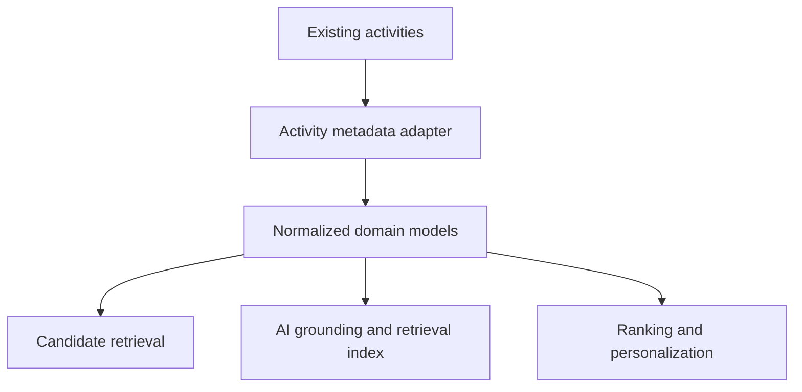
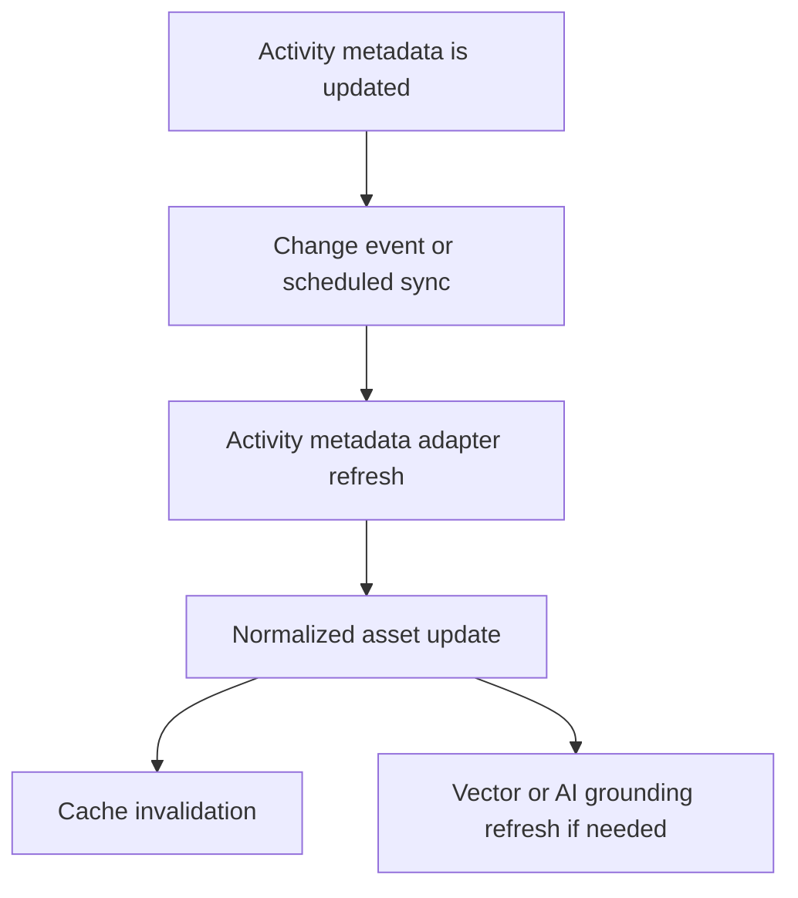

# Activity Metadata

> **Navigation:** [Docs home](../../README.md#documentation-structure) | [Next: Customer Profile Service ->](./06-customer-profile-service.md)

## Overview

Existing activities should remain the source of truth for what can be shown to a customer, with the required personalization metadata added directly onto those activities.

It should not become the place where:

- ranking policy lives
- suitability rules are enforced
- journey selection logic is embedded
- AI prompts or system decisioning are hardcoded into activity records

Activities should describe what exists and how it is configured. Backend services should decide what should be shown, to whom, and why.

---

## Role Of Activity Metadata In The Platform

Activity metadata is most valuable when it makes existing activities retrievable and governable without destabilizing decision systems.

It should enable teams to manage:

- offers and offer variants
- activity definitions and supporting guidance
- CTAs and deep links
- educational or comparison activities
- campaign-aware variants where needed

while the platform handles:

- active-journey selection
- qualification and suitability checks
- ranking
- AI-assisted interpretation and explanation

---

## Minimal Activity Metadata Shape

The normalized catalog uses a deliberately small shape. A catalog document contains only `serviceCategory` and `assets`; every asset carries the fields below. Approval, lifecycle, disclosure, provider, and ranking policy remain outside this catalog and are enforced by the relevant backend services.

| Field | Purpose |
|---|---|
| `assetId` | Canonical asset identifier |
| `assetType` | Normalized domain type, such as `OfferCandidate`, `ActionDefinition`, or `GuidanceAsset` |
| `serviceCategory` | Journey or vertical the asset belongs to |
| `funnelStages` | Journey stages the asset supports |
| `conversionGoal` | Intended qualified-conversion outcome |
| `cta` | Renderable `type`, `label`, and `deepLink` |
| `retrievalSummary` | Retrieval-friendly asset summary |
| `serviceSpecific.householdFit` | Household types the asset fits |
| `aiSupportFields` | Approved `plainLanguageSummary`, `approvedExplainerText`, and `retrievalTags` |
| `metadataRevision` | Traceable version used in decisions |

### Optional Service-Specific Extensions

`householdFit` is the shared service-specific field used by local retrieval. Categories can add narrowly scoped descriptive attributes when needed, but those attributes must not encode eligibility, suitability, ranking, lifecycle, or compliance policy.

Examples include vehicle type for novated leasing and access technology for broadband.

### AI Support Fields

Approved AI grounding uses:

- short plain-language summary
- approved explainer text
- retrieval tags or semantic hints

These fields improve AI grounding without moving control away from approved activity definitions.

---

## Activity Types To Model Explicitly

Recommended first-class activity types:

- offer
- provider profile
- educational explainer
- comparison module
- calculator or tool descriptor
- CTA definition
- disclosure or compliance asset
- AI grounding fragment

This helps product and engineering reason about how each activity enters candidate retrieval and final slot composition.

---

## Suggested Activity Type Mapping

The implementation becomes clearer if each activity type maps to a normalized domain object.

| Activity type | Normalized domain object | Primary usage |
|---|---|---|
| offer | `OfferCandidate` | ranking and CTA generation |
| provider profile | `ProviderDescriptor` | comparison and explainer content |
| explainer article | `GuidanceAsset` | research and reassurance slots |
| CTA definition | `ActionDefinition` | next-best-action rendering |
| disclosure asset | `DisclosureReference` | compliance support |
| AI grounding fragment | `GroundingSnippet` | RAG and explanation generation |

This avoids making downstream services understand raw activity-source shapes directly.

---

## Query Strategy

The activity query layer should support broad candidate retrieval based on:

- service-category alignment
- funnel stage fit
- campaign context

This keeps activity metadata responsible for description, while backend services remain responsible for decision logic and constraints.

---

## Normalization Requirements

The adapter should transform activities into stable domain models that include:

- normalized identifiers
- service taxonomy
- structured CTA definitions
- deep-link targets or route templates for CTA execution
- retrieval-friendly summaries
- asset version or metadata revision

Normalization is important because the ranking and AI layers should consume a predictable domain model, not raw activity-source shapes.

### Example Normalized Asset

```json
{
  "assetId": "offer-health-family-001",
  "assetType": "OfferCandidate",
  "serviceCategory": "health_insurance",
  "funnelStages": ["compare", "quote"],
  "conversionGoal": "start_quote",
  "cta": {
    "type": "get_quote",
    "label": "Get a family cover quote",
    "deepLink": "/quote/health-insurance?family=true"
  },
  "retrievalSummary": "Family cover with extras and quote-ready positioning",
  "serviceSpecific": {
    "householdFit": ["family", "couple_with_children"]
  },
  "aiSupportFields": {
    "plainLanguageSummary": "Family health cover with hospital and extras benefits.",
    "approvedExplainerText": "A quote-ready family cover option for households comparing health insurance.",
    "retrievalTags": ["family health", "hospital cover", "extras"]
  },
  "metadataRevision": "offer-health-family-001@17"
}
```

---

## Integration Architecture



The adapter layer should isolate:

- activity-source schema details
- query logic
- cache invalidation behavior

from the rest of the platform.

---

## Update And Sync Flow

Recommended update flow:



Implementation notes:

- invalidate only the affected normalized assets where possible
- refresh embeddings only when meaning-bearing fields change
- record metadata revision so decision traces can refer to the exact activity version served

---

## Integration Recommendations

- use the existing activity APIs
- normalize responses into domain models
- isolate activity-source logic in infrastructure adapters
- support change-aware caching
- emit change events when metadata changes affect personalization
- version normalized assets so ranking and analytics can reference what was actually served

---

## Caching And Invalidation Detail

Recommended cache boundaries:

- cache raw source responses only inside the adapter
- cache normalized assets for downstream retrieval
- treat metadata revision changes as invalidation triggers
- keep AI grounding and vector-index refresh decoupled from live retrieval where possible

This reduces source-system load without allowing stale or non-compliant activities to remain in circulation.

---

## Governance And Operating Model

The activity metadata model should support collaboration across:

- marketing
- provider management
- operations
- compliance
- product
- engineering

That requires upstream governance processes for approvals, expiry, disclosures, campaign ownership, provider ownership, and content stewardship. These concerns are intentionally not fields in the minimal activity catalog.

Recommended governance questions:

- who can change activity metadata
- who approves AI grounding text
- who owns compliance-sensitive edits
- who owns and validates CTA deep-link targets
- how withdrawn activities are suppressed across channels

---

## Common Pitfalls

Avoid:

- storing ranking rules in activity metadata
- making the activity source the source of truth for suitability
- using freeform content fields where structured fields are needed
- treating AI grounding content as uncontrolled editorial text

---

## Summary

Activity metadata should act as the platform's source of describable, retrievable options, not its decision engine.

Its job is to make high-quality, well-governed activities available for:

- deterministic candidate retrieval
- AI grounding and semantic retrieval
- personalized experience assembly

while backend services retain control of ranking, qualification, and journey decisioning.

---

| <- Previous | Next -> |
|---|---|
| [System Architecture](../architecture/04-system-architecture.md) | [Customer Profile Service](./06-customer-profile-service.md) |
