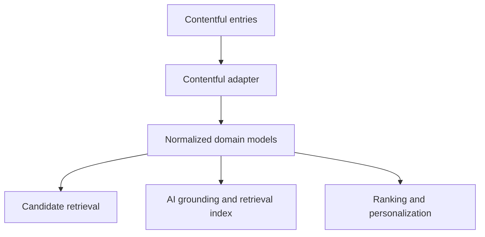

# Contentful Integration

> **Navigation:** [Docs home](../../README.md#documentation-structure) | [Next: Customer Profile Service ->](./06-customer-profile-service.md)

## Overview

Contentful should remain the source of truth for managed content, campaign copy, provider descriptions, and offer metadata.

It should not become the place where:

- ranking policy lives
- suitability rules are enforced
- journey selection logic is embedded
- AI prompts or system decisioning are hardcoded into content entries

The CMS should manage what exists and how it is described. Backend services should decide what should be shown, to whom, and why.

---

## Role Of Contentful In The Platform

Contentful is most valuable when it supports fast operational change without destabilizing decision systems.

It should enable teams to manage:

- offers
- provider content
- disclosures
- CTAs
- educational assets
- campaign copy

while the platform handles:

- active-journey selection
- qualification and suitability checks
- ranking
- AI-assisted interpretation and explanation

---

## Recommended Content Model

### Universal Metadata Fields

Every managed asset should carry a common metadata backbone.

| Field | Purpose |
|---|---|
| service_category | Which journey or vertical the asset belongs to |
| subtype | More specific classification inside the category |
| provider | Provider or partner association |
| region | Geographic availability |
| funnel_stage | Discover, research, compare, quote, apply, renew, or resume |
| conversion_goal | Intended business outcome |
| cta_type | Quote, callback, compare, check eligibility, apply, resume |
| compliance_flags | Approval and disclosure requirements |
| freshness | Recency and validity relevance |
| priority | Explicit business control |
| lifecycle_status | Draft, approved, active, expired, withdrawn |
| campaign_owner | Operational accountability |

### Service-Specific Extensions

Examples:

- **Novated leasing:** employer requirement, vehicle type, tax-benefit theme
- **Health insurance:** cover tier, household fit, extras focus
- **Broadband:** speed tier, access technology, contract length

### AI Support Fields

To support AI-assisted experiences well, the model should also allow:

- short plain-language summary
- approved explainer text
- FAQ fragments
- structured objections or reassurance points
- retrieval tags or semantic hints

These fields improve AI grounding without moving control away from approved content.

---

## Content Types To Model Explicitly

Recommended first-class content types:

- offer
- provider profile
- educational explainer
- comparison module
- calculator or tool descriptor
- CTA definition
- disclosure or compliance asset
- AI grounding fragment

This helps product and engineering reason about how each asset enters candidate retrieval and final slot composition.

---

## Query Strategy

The CMS query layer should support broad candidate retrieval based on:

- service-category alignment
- region and provider availability
- funnel stage fit
- campaign context
- lifecycle and approval state

Avoid encoding business rules directly in CMS queries beyond hard constraints such as:

- unpublished content
- expired offers
- missing compliance approval
- withdrawn provider assets

This keeps the CMS responsible for content availability, while backend services remain responsible for decision logic.

---

## Normalization Requirements

The adapter should transform Contentful entries into stable domain models that include:

- normalized identifiers
- provider and service taxonomy
- structured CTA definitions
- references to disclosures and eligibility rules
- publish and expiry timestamps
- retrieval-friendly summaries
- asset version or publish revision

Normalization is important because the ranking and AI layers should consume a predictable domain model, not raw CMS shapes.

---

## Integration Architecture

The adapter layer should isolate:

- Contentful schema details
- GraphQL query logic
- publish-state handling
- cache invalidation behavior

from the rest of the platform.

---

## Integration Recommendations

- use GraphQL APIs
- normalize responses into domain models
- isolate CMS logic in infrastructure adapters
- support publish-aware caching
- emit change events when metadata changes affect personalization
- version normalized assets so ranking and analytics can reference what was actually served

---

## Governance And Operating Model

The CMS model should support collaboration across:

- marketing
- provider management
- operations
- compliance
- product
- engineering

That requires explicit fields for:

- approvals
- expiry
- disclosures
- campaign ownership
- provider ownership
- content stewardship

Recommended governance questions:

- who can publish offer changes
- who approves AI grounding text
- who owns compliance-sensitive edits
- how withdrawn assets are suppressed across channels

---

## Common Pitfalls

Avoid:

- storing ranking rules in content entries
- making the CMS the source of truth for suitability
- using freeform content fields where structured fields are needed
- under-modeling approval and lifecycle state
- treating AI grounding content as uncontrolled editorial text

---

## Summary

Contentful should act as the platform's managed content and metadata system, not its decision engine.

Its job is to make high-quality, well-governed assets available for:

- deterministic candidate retrieval
- AI grounding and semantic retrieval
- personalized experience assembly

while backend services retain control of ranking, qualification, and journey decisioning.

---

| <- Previous | Next -> |
|---|---|
| [System Architecture](../architecture/04-system-architecture.md) | [Customer Profile Service](./06-customer-profile-service.md) |
