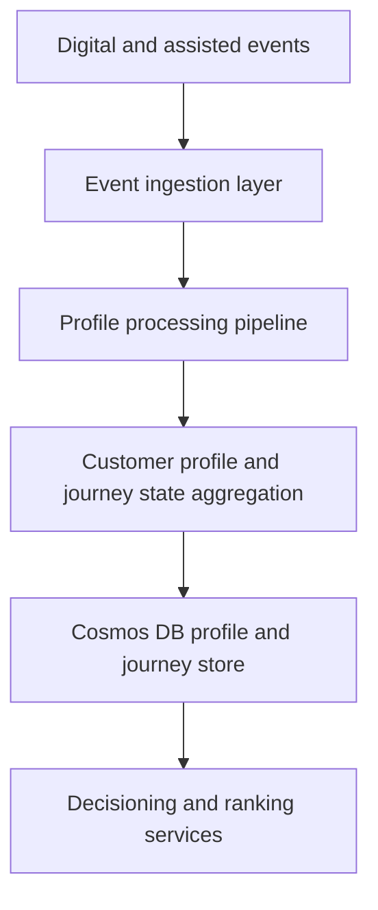

# Customer Profile Service

> **Navigation:** [Docs home](../../README.md#documentation-structure) | [Next: Ranking Engine ->](./07-ranking-engine.md)

## Overview

The Customer Profile Service is responsible for maintaining a continuously updated view of each lead.

It should manage:

- a durable customer profile
- one or more journey states per customer
- the projections needed for personalization and lead generation across service categories

---

# Goals

The Customer Profile Service should:

- maintain an up-to-date customer profile
- maintain multiple concurrent journey states
- aggregate behavior over time
- support real-time and near-real-time updates
- calculate customer-level and journey-level scores
- expose a consistent API for downstream systems
- support reprocessing and historical correction

---

# Core Responsibilities

## 1. Customer Profile Management

Maintain a durable profile including:

- identity and account linkage
- household and employment attributes
- cross-journey behavioral summaries
- overall lead score

---

## 2. Journey State Management

Maintain service-specific journey states including:

- service category
- intent
- funnel stage
- urgency
- qualification state
- journey-level score

---

## 3. Behavioral Aggregation

Ingest and aggregate events such as:

- content_viewed
- offer_clicked
- quote_started
- quote_completed
- callback_requested
- application_started
- address_checked
- provider_selected

These events are transformed into meaningful profile and journey signals.

---

## 4. Intent Inference

Derive customer and journey intent from behavior.

Examples:

- researching
- comparing
- checking eligibility
- quote-ready
- application-ready
- renewal-switching
- returning-to-resume

Intent should be maintained primarily at the journey level, with customer-level summaries where useful.

---

## 5. Lead Scoring

Compute both customer-level and journey-level scores based on:

- engagement quality
- service-category fit
- qualification confidence
- conversion actions
- recency of activity
- prior provider handoff outcomes
- return and resume behavior

Scores are dynamic projections, not stored constants.

---

# High-Level Architecture



---

# Customer State Model

## Example Structure

```json
{
  "customerId": "12345",
  "profile": {
    "householdType": "family",
    "employmentType": "full_time",
    "location": "QLD"
  },
  "customerSummary": {
    "isReturningCustomer": true,
    "leadScore": 78
  },
  "journeys": [
    {
      "serviceCategory": "health_insurance",
      "stage": "quote_ready",
      "intent": "comparing_providers",
      "resumeCandidate": true
    },
    {
      "serviceCategory": "broadband",
      "stage": "research",
      "intent": "checking_availability",
      "resumeCandidate": false
    }
  ]
}
```

---

## Suggested Persistence Model

A concrete persistence split makes the service easier to reason about.

| Entity | Suggested key | Purpose |
|---|---|---|
| customer profile | `customerId` | durable customer-wide facts and summaries |
| journey state | `customerId + journeyId` | service-specific live decision state |
| processed-event marker | `eventId` | idempotency and replay safety |
| projection checkpoint | `customerId` | operational rebuild and replay coordination |

This can be implemented as separate containers or as distinct document types in the same partitioned store, depending on throughput and operational preferences.

### Example Journey Document

```json
{
  "customerId": "12345",
  "journeyId": "journey-health-001",
  "documentType": "journey_state",
  "serviceCategory": "health_insurance",
  "intent": "comparing_providers",
  "stage": "quote_ready",
  "resumeCandidate": true,
  "qualification": {
    "coverageRegionMatch": true,
    "serviceabilityConfirmed": true
  },
  "scores": {
    "journeyScore": 0.78
  },
  "version": 14
}
```

---

# Event Model

## Supported Events

The system should ingest structured events such as:

- `content_viewed`
- `offer_viewed`
- `quote_started`
- `quote_completed`
- `callback_requested`
- `application_started`
- `eligibility_checked`
- `provider_handoff_completed`
- `journey_resumed`

---

## Example Event

```json
{
  "eventId": "evt-001",
  "eventType": "quote_started",
  "customerId": "12345",
  "occurredAt": "2026-05-11T10:15:00Z",
  "ingestedAt": "2026-05-11T10:15:02Z",
  "metadata": {
    "serviceCategory": "health_insurance",
    "provider": "Provider A",
    "funnelStage": "quote",
    "region": "QLD"
  }
}
```

---

## Event Processing Detail

Recommended processing steps for each event:

1. validate schema and required identifiers
2. check idempotency using `eventId`
3. load current profile and affected journey documents
4. apply deterministic aggregation rules
5. update derived scores and summaries
6. write updated projections with optimistic concurrency
7. emit downstream change notifications if needed

This keeps the service deterministic and replayable.

---

# Processing Model

## Event -> State Transformation

```text
Event Stream
        ↓
Event Processor
        ↓
Profile + Journey Aggregation Logic
        ↓
Profile / Journey Update
        ↓
Cosmos DB Projection
```

---

## Key Principle

The system should always prefer:

> event-driven updates over direct mutations

This ensures:

- auditability
- replayability
- correctness over time

Direct profile mutations should be reserved for controlled repair or backfill workflows, not normal application traffic.

---

## Processing Guarantees

To keep profile state correct under asynchronous delivery, the service should guarantee:

- idempotent processing keyed by `eventId`
- per-customer ordering using source sequence numbers where available, otherwise `occurredAt`
- optimistic concurrency on profile and journey projections using document versioning / ETags
- deterministic replay for rebuilds and historical correction

If an older event arrives after a newer projection has already been written, the processor should not blindly overwrite state. It should either merge deterministically or trigger reprocessing for that customer's profile and journeys from the authoritative event stream.

---

# Active Journey Support

The profile service does not have to decide the active journey permanently, but it should expose enough information for the decisioning layer to choose it reliably.

Recommended outputs:

- all current journey states
- journey-level scores
- journey recency
- resume indicators
- cross-journey return summary

This allows live decisioning to pick the best journey for the current session without losing visibility of parallel journeys.

---

## Example Read Payloads

### `GET /customers/{customerId}`

```json
{
  "customerId": "12345",
  "profile": {
    "householdType": "family",
    "employmentType": "full_time",
    "location": "QLD"
  },
  "customerSummary": {
    "isReturningCustomer": true,
    "leadScore": 78
  }
}
```

### `GET /customers/{customerId}/journeys`

```json
{
  "customerId": "12345",
  "journeys": [
    {
      "journeyId": "journey-health-001",
      "serviceCategory": "health_insurance",
      "intent": "comparing_providers",
      "stage": "quote_ready",
      "resumeCandidate": true,
      "journeyScore": 0.78
    },
    {
      "journeyId": "journey-broadband-001",
      "serviceCategory": "broadband",
      "intent": "checking_availability",
      "stage": "research",
      "resumeCandidate": false,
      "journeyScore": 0.41
    }
  ]
}
```

---

# Storage Strategy

## Cosmos DB Usage

Cosmos DB is used for:

- customer profiles
- journey-state projections
- aggregated state
- fast read access for personalization

---

## Partitioning Strategy

Recommended partition key:

- `customerId`

This ensures:

- fast lookup per customer
- scalable horizontal partitioning
- predictable access patterns

---

## Consistency And Read Strategy

Recommended read behavior for live personalization:

- read the latest committed profile document
- read all active or recent journey documents for the customer
- prefer bounded-staleness or session-consistent reads where supported
- avoid fan-out across unrelated partitions during live decisioning

This keeps the service fast enough for request-time orchestration while preserving useful consistency for active-journey selection.

---

## Separation Of Data

| Type | Storage |
|---|---|
| Raw events | Event store / stream |
| Profile and journey projections | Cosmos DB |
| Analytics projections | Data warehouse / lake |

---

# CQRS Approach

The service should follow CQRS principles.

## Commands

- ingest event
- update profile attributes
- recalculate scores
- refresh journey intent and eligibility projections

---

## Queries

- get customer profile
- get journey states
- get engagement summary
- get qualification summary
- get return and resume summary

---

## Projections

Maintain derived views such as:

- engagement summary
- journey progression
- provider affinity
- service-category propensity
- return readiness

---

# API Design

## Example Endpoints

### Get Profile

```http
GET /customers/{customerId}
```

### Get Summary

```http
GET /customers/{customerId}/summary
```

### Get Journeys

```http
GET /customers/{customerId}/journeys
```

### Ingest Event

```http
POST /customers/{customerId}/events
```

### Trigger Recalculation

```http
POST /customers/{customerId}/recalculate
```

---

# Summary

The Customer Profile Service is the system of record for current lead understanding.

It transforms raw interactions into structured intelligence used by:

- ranking engines
- personalization services
- sales-assist experiences
- AI interpretation and guidance layers

Its core value is:

> turning fragmented behavior into usable customer profile and journey intelligence for real-time decisioning

---

| <- Previous | Next -> |
|---|---|
| [Contentful Integration](./05-contentful-integration.md) | [Ranking Engine](./07-ranking-engine.md) |
