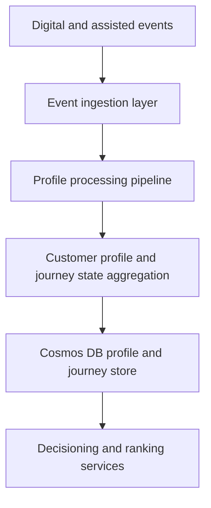

# Customer Profile Service

> **Navigation:** [Docs home](../../README.md#documentation-structure) | [Next: Ranking Engine ->](./07-ranking-engine.md)

## Overview

The Customer Profile Service is responsible for maintaining a continuously updated view of each lead.

It should manage:

- a durable customer profile
- one or more journey states per customer
- the projections needed for personalization and lead generation across service categories

---

## Who Should Read This

| Audience | Why this page matters |
|---|---|
| Product | understand what customer and journey state the platform can reliably use |
| Engineering | understand service ownership, storage choices, and where to go for deeper contracts |
| Analytics and operations | understand which state is operational versus analytical |

---

## Goals

The Customer Profile Service should:

- maintain an up-to-date customer profile
- maintain multiple concurrent journey states
- aggregate behavior over time
- support real-time and near-real-time updates
- calculate customer-level and journey-level scores
- expose a consistent API for downstream systems
- support reprocessing and historical correction

---

## What This Service Owns

- durable customer profile facts
- multiple concurrent journey states
- customer-level and journey-level projections
- event-driven updates and replayable state rebuilds
- read models used by live decisioning

---

## High-Level Architecture

---

## How To Read This Section

Use the overview page for orientation, then go deeper based on what you need:

| Detail page | Best for | Covers |
|---|---|---|
| [State and Persistence](./customer-profile-service/01-state-and-persistence.md) | product + engineering | customer and journey ownership, persistence split, storage, and projection design |
| [Event Processing and APIs](./customer-profile-service/02-event-processing-and-apis.md) | engineering | event model, processing guarantees, read payloads, CQRS, and endpoints |

## Key Takeaways

- for product, customer understanding is durable across sessions and multiple journeys can exist in parallel without losing focus on the active one
- for engineering, the service is event-driven and replayable, and live decisioning should read stable customer-scoped projections rather than raw event streams

---

## Summary

The Customer Profile Service is the system of record for current lead understanding.

It transforms raw interactions into structured intelligence used by:

- ranking engines
- personalization services
- sales-assist experiences
- AI interpretation and guidance layers

Its core value is:

> turning fragmented behavior into usable customer profile and journey intelligence for real-time decisioning

---

| <- Previous | Next -> |
|---|---|
| [Contentful Integration](./05-contentful-integration.md) | [Ranking Engine](./07-ranking-engine.md) |
