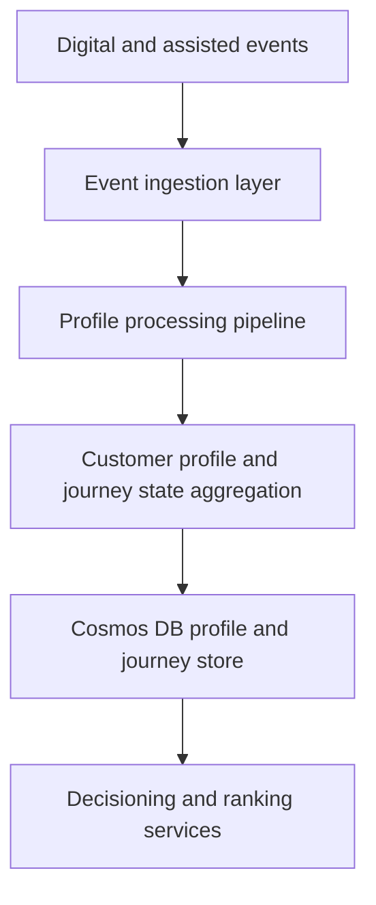

# Customer Profile Service: State and Persistence

> **Navigation:** [Docs home](../../../README.md#documentation-structure) | [Parent: Customer Profile Service](../06-customer-profile-service.md) | [Next: Event Processing and APIs ->](./02-event-processing-and-apis.md)

## Overview

This document covers the **state model and storage design** for the Customer Profile Service.

It is most useful for engineering and product readers who need to understand:

- what the service owns
- how customer and journey state are separated
- how behavior becomes durable projections
- how the persistence model supports live decisioning

---

## Core Responsibilities

### 1. Customer Profile Management

Maintain a durable profile including:

- durable customer attributes
- household and employment attributes
- cross-journey behavioral summaries
- overall lead score

### 2. Journey State Management

Maintain service-specific journey states including:

- service category
- intent
- funnel stage
- urgency
- qualification state
- journey-level score

### 3. Behavioral Aggregation

Ingest and aggregate events such as:

- content_viewed
- offer_clicked
- quote_started
- quote_completed
- callback_requested
- application_started
- address_checked
- provider_selected

These events are transformed into meaningful profile and journey signals.

### 4. Intent Inference

Derive customer and journey intent from behavior.

Examples:

- researching
- comparing
- checking eligibility
- quote-ready
- application-ready
- renewal-switching
- returning-to-resume

Intent should be maintained primarily at the journey level, with customer-level summaries where useful.

### 5. Lead Scoring

Compute both customer-level and journey-level scores based on:

- engagement quality
- service-category fit
- qualification confidence
- conversion actions
- recency of activity
- prior provider handoff outcomes
- return and resume behavior

Scores are dynamic projections, not stored constants.

---

## High-Level Architecture



---

## Customer State Model

### Example Structure

```json
{
  "customerId": "12345",
  "attributes": {
    "householdType": "family",
    "employmentType": "full_time",
    "location": "QLD"
  },
  "customerSummary": {
    "leadScore": 78
  },
  "journeys": [
    {
      "serviceCategory": "health_insurance",
      "stage": "quote_ready",
      "intent": "comparing_providers",
      "resumeCandidate": true
    },
    {
      "serviceCategory": "broadband",
      "stage": "research",
      "intent": "checking_availability",
      "resumeCandidate": false
    }
  ]
}
```

---

## Suggested Persistence Model

A concrete persistence split makes the service easier to reason about.

| Entity | Suggested key | Purpose |
|---|---|---|
| customer profile | `customerId` | durable customer-wide facts and summaries |
| journey state | `customerId + journeyId` | service-specific live decision state |
| processed-event marker | `eventId` | idempotency and replay safety |
| projection checkpoint | `customerId` | operational rebuild and replay coordination |

This can be implemented as separate containers or as distinct document types in the same partitioned store, depending on throughput and operational preferences.

### Example Journey Document

```json
{
  "customerId": "12345",
  "journeyId": "journey-health-001",
  "documentType": "journey_state",
  "serviceCategory": "health_insurance",
  "intent": "comparing_providers",
  "stage": "quote_ready",
  "resumeCandidate": true,
  "qualification": {
    "coverageRegionMatch": true,
    "serviceabilityConfirmed": true
  },
  "scores": {
    "journeyScore": 0.78
  },
  "version": 14
}
```

---

## Storage Strategy

### Cosmos DB Usage

Cosmos DB is used for:

- customer profiles
- journey-state projections
- aggregated state
- fast read access for personalization

### Partitioning Strategy

Recommended partition key:

- `customerId`

This ensures:

- fast lookup per customer
- scalable horizontal partitioning
- predictable access patterns

### Separation Of Data

| Type | Storage |
|---|---|
| Raw events | Event store / stream |
| Profile and journey projections | Cosmos DB |
| Analytics projections | Data warehouse / lake |

---

## Summary

The service should keep customer-wide state durable, journey state independently updatable, and storage choices aligned to fast live reads plus replayable event-driven rebuilds.

---

| <- Previous | Next -> |
|---|---|
| [Customer Profile Service](../06-customer-profile-service.md) | [Event Processing and APIs](./02-event-processing-and-apis.md) |
