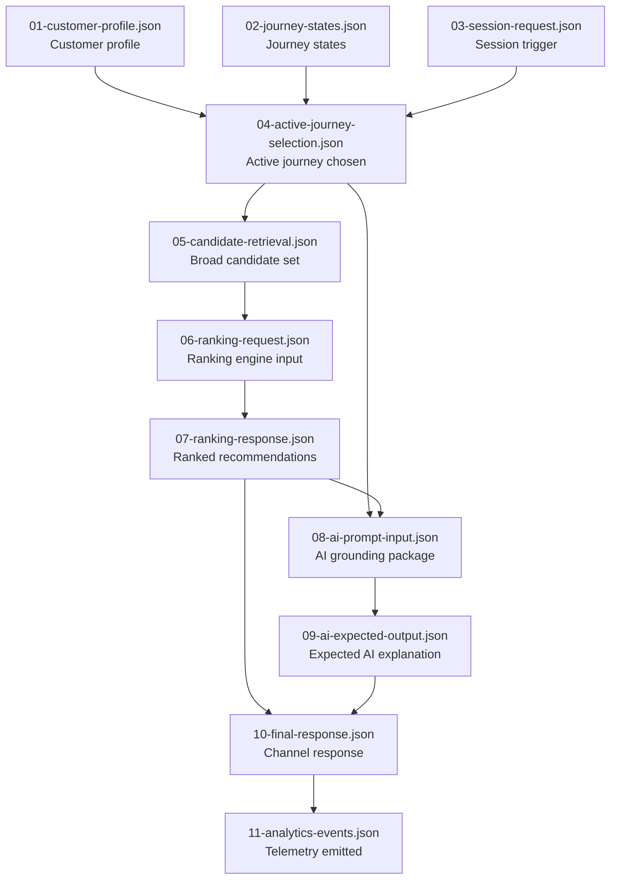

# Mock Data

This folder contains structured mock data for the four POC scenarios defined in [`docs/delivery/12-poc-scope.md`](../docs/delivery/12-poc-scope.md), plus a supplementary **single-customer progression set** that reuses one `customer_id` across multiple lifecycle stages.

The data is designed to be processed step-by-step through the platform's services and AI model to validate deterministic outputs.

---

## Folder Structure

```
mock-data/
  shared/
    activities-health-insurance.json   Normalized health insurance activity assets
    activities-broadband.json          Normalized broadband activity assets
    grounding-snippets.json            AI grounding snippets for both verticals
  scenarios/
    01-primary-returning-multi-journey/   Returning customer, two concurrent journeys
    02-secondary-new-customer/            First-time customer, single journey
    03-secondary-resume-quote/            Returning customer resuming a saved quote
    04-secondary-compliance-suppression/  State-restricted offer suppressed by compliance
    05-progression-stage-01-health-discovery/      Same customer, first health visit
    06-progression-stage-02-multi-journey/         Same customer, later multi-journey return
    07-progression-stage-03-resume-quote/          Same customer, broadband quote resume
    08-progression-stage-04-compliance-after-move/ Same customer, post-move compliance suppression
    09-supplemental-eligibility-failure/           Eligibility suppresses quote-ready broadband promotion
    10-supplemental-three-concurrent-journeys/     Broadband leads among three concurrent journeys
    11-supplemental-resume-expired/                Expired broadband resume falls back to compare
    12-supplemental-ai-deterministic-conflict/     Deterministic health selection overrides AI broadband hint
```

---

## Scenarios

### Core reference scenarios

| Folder | Scenario | Customer | Verticals | Active journey |
|---|---|---|---|---|
| [`01-primary-returning-multi-journey`](./scenarios/01-primary-returning-multi-journey/README.md) | Returning customer with health + broadband journeys | `cust-20481` | health_insurance, broadband | broadband selected |
| [`02-secondary-new-customer`](./scenarios/02-secondary-new-customer/README.md) | First-time customer, single health insurance journey | `cust-99001` | health_insurance | health_insurance |
| [`03-secondary-resume-quote`](./scenarios/03-secondary-resume-quote/README.md) | Returning customer resuming a saved broadband quote | `cust-55312` | broadband | broadband |
| [`04-secondary-compliance-suppression`](./scenarios/04-secondary-compliance-suppression/README.md) | Returning customer in TAS with a state-restricted health bundle suppressed | `cust-66140` | health_insurance | health_insurance |

---

### Single-customer progression stages

These additional stages use the **same customer** (`cust-77120`) to show how profile data, journeys, and expected decisions can evolve over time without changing the original four reference scenarios.

| Folder | Lifecycle stage | Customer | Main outcome |
|---|---|---|---|
| `05-progression-stage-01-health-discovery` | First visit, health discovery | `cust-77120` | health comparison leads |
| `06-progression-stage-02-multi-journey` | Later return with health + broadband journeys | `cust-77120` | broadband move-home leads, health stays secondary |
| `07-progression-stage-03-resume-quote` | Saved broadband quote resume | `cust-77120` | resume CTA leads |
| `08-progression-stage-04-compliance-after-move` | Post-move health comparison in TAS | `cust-77120` | comparison leads, bundle suppressed for compliance |

Read these four stage folders in order if you want a longitudinal same-customer walkthrough instead of standalone scenario slices.

---

### Supplemental control scenarios

These additional standalone scenarios focus on specific decisioning guardrails and edge cases rather than a single customer lifecycle.

| Folder | Control case | Main outcome |
|---|---|---|
| `09-supplemental-eligibility-failure` | Eligibility failure after broadband serviceability check | Broadband journey stays active, ineligible offer suppressed, safe guide fallback leads |
| `10-supplemental-three-concurrent-journeys` | Three concurrent journeys for one customer | Broadband leads, health stays secondary, novated leasing is deferred |
| `11-supplemental-resume-expired` | Saved broadband quote expired | Resume suppressed, comparison restart leads |
| `12-supplemental-ai-deterministic-conflict` | AI hint conflicts with deterministic active-journey rules | Health session leads, deterministic override is recorded |

---

## Proposed Scenario Expansion Matrix

Use this matrix as a reference when adding more test packs. Each row represents a combination the harness should eventually cover, plus the intended deterministic outcome the fixtures should prove.

| Scenario theme | Combination to test | Intended outcome |
|---|---|---|
| **Eligibility failure** | Strong intent and correct journey, but address, serviceability, or profile rules fail | Active journey can still be selected, but ineligible quote or offer paths are suppressed and a safe fallback such as guide, eligibility check, or callback leads |
| **Region change without compliance breach** | Same journey and offer family, but customer region changes to another still-supported state | Active journey stays the same, ranking can shift, and no compliance suppression occurs |
| **Three concurrent journeys** | Same customer has health insurance, broadband, and novated leasing journeys at once | Deterministic active-journey selection chooses one leader, and the other journeys are retained only as secondary prompts or deferred contexts |
| **Low-intent returning customer** | Existing journey is present, but recency is weak and session signals are weak | Softer compare or guide CTAs lead instead of resume or get-quote actions |
| **Renewal-window urgency** | Health renewal or broadband contract end is close | The renewal-linked journey outranks generic discovery and urgency raises more conversion-ready CTAs |
| **Provider handoff quality guardrail** | A commercially strong provider has weaker downstream handoff quality than alternatives | The better-qualified provider wins even if another provider might otherwise rank higher on raw conversion potential |
| **Channel-specific behavior** | Same customer and same journey, but one session is web and another is assisted sales | Core journey can stay the same while the CTA changes, for example from self-serve quote to callback or assisted handoff |
| **AI hint vs deterministic rules** | AI suggests a different journey or action than the deterministic systems prefer | Deterministic controls win, and the trace shows AI remained advisory rather than authoritative |
| **Resume expired** | Saved quote exists, but the resume window has expired | Resume CTA is suppressed and a restart, rebuild, or recompare path leads instead |
| **Cross-sell allowed but not primary** | One active primary journey and one weaker secondary cross-sell signal | The primary journey still leads, while the secondary category appears only as a supporting prompt |

### Highest-value next additions

If you only add a few more scenarios next, prioritize these first:

1. **Eligibility failure** — validates hard suppression and fallback behavior.
2. **Three concurrent journeys** — validates active-journey choice under higher competition.
3. **Resume expired** — validates lifecycle handling when a previously good CTA is no longer valid.
4. **AI hint vs deterministic rules** — validates that AI stays supportive and never becomes the decision authority.

These four give the best coverage of the platform's most important guarantees: deterministic control, compliance-safe suppression, lifecycle-aware CTA handling, and multi-journey prioritization.

---

## Per-Scenario Files

Each scenario folder contains 11 numbered files representing the full end-to-end trace:

| File | Content | Role in the flow |
|---|---|---|
| `01-customer-profile.json` | Durable customer profile | Starting state loaded by the profile service |
| `02-journey-states.json` | One or more journey state entities | Journey history loaded alongside the profile |
| `03-session-request.json` | Incoming orchestrator request | Trigger for the decisioning flow |
| `04-active-journey-selection.json` | Active-journey selection result | Which journey should lead the session and why |
| `05-candidate-retrieval.json` | Retrieval query and candidate set | Broad candidates retrieved from activity metadata |
| `06-ranking-request.json` | Full ranking engine request | Input to the ranking engine |
| `07-ranking-response.json` | Ranking engine response | Ranked and suppressed candidates with reasons |
| `08-ai-prompt-input.json` | Assembled AI prompt context package | Input to the AI model |
| `09-ai-expected-output.json` | Expected AI model response | Deterministic target output for validation |
| `10-final-response.json` | Final orchestrated experience response | What the channel receives |
| `11-analytics-events.json` | Expected telemetry events | Events emitted during the session flow |

---

## Scenario Flow



This mirrors the intended runtime flow: customer and journey state are loaded first, the active journey is selected, candidates are retrieved and ranked, AI produces a grounded explanation, the orchestrator assembles the final response, and analytics capture the resulting decision trace.

---

## Shared Assets

### `shared/activities-health-insurance.json`

Normalized health insurance activity assets conforming to the activity metadata model in [`docs/services/05-activity-metadata.md`](../docs/services/05-activity-metadata.md).

Includes:
- `offer-health-family-001` — family cover offer (Provider H)
- `offer-health-singles-001` — singles cover offer (Provider H)
- `offer-health-hospital-extras-bundle-001` — combined bundle (Provider K, NSW/VIC/QLD only)
- `action-health-compare-001` — comparison tool CTA
- `action-health-resume-compare-001` — resume comparison CTA
- `guide-health-switching-001` — switching guide
- `guide-health-families-001` — families audience guide

### `shared/activities-broadband.json`

Normalized broadband activity assets.

Includes:
- `offer-bbd-fast-family-001` — fast family nbn100 plan (Provider B)
- `offer-bbd-fibre-premium-001` — premium fibre nbn1000 plan (Provider A, NSW/VIC/QLD only)
- `action-bbd-address-check-001` — address serviceability check CTA
- `action-bbd-compare-plans-001` — plan comparison CTA
- `action-bbd-resume-quote-001` — resume saved quote CTA
- `guide-bbd-moving-home-001` — moving home broadband guide

### `shared/grounding-snippets.json`

AI grounding snippets (`GroundingSnippet` asset type) for both verticals. Each snippet is a bounded, approved piece of content that the AI model uses to ground its responses.

---

## How To Use

### Step-by-step processing

Each scenario is designed to be processed in file order:

1. Load `01-customer-profile.json` and `02-journey-states.json` into the profile service
2. Send `03-session-request.json` to the orchestrator
3. Validate the orchestrator produces output matching `04-active-journey-selection.json`
4. Validate the retrieval layer returns candidates matching `05-candidate-retrieval.json`
5. Send `06-ranking-request.json` to the ranking engine
6. Validate the ranking engine response matches `07-ranking-response.json`
7. Send `08-ai-prompt-input.json` to the AI model
8. Validate the AI response matches `09-ai-expected-output.json`
9. Validate the final orchestrated response matches `10-final-response.json`
10. Validate the telemetry events match `11-analytics-events.json`

### Validating AI outputs

`09-ai-expected-output.json` defines the target AI response for each scenario. It includes:

- `response` — the expected structured output matching the response contract
- `validation` — field-level validation checks (required fields, grounding coverage, claim safety, length bounds)
- `response_status` — `accepted` or `rejected`

When processing against a live AI model, compare the actual output to the expected response to evaluate:
- whether required fields are present
- whether grounding asset IDs are cited
- whether no unsupported claims are introduced
- whether summary and CTA text stay within configured length bounds

---

## Data Conventions

- IDs use kebab-case with a semantic prefix: `cust-`, `journey-`, `sess-`, `offer-`, `action-`, `guide-`, `gs-`, `air-`
- Timestamps use ISO 8601 format with UTC offset
- `metadata_revision` fields use the format `{assetId}@{version}` for traceability
- `ranking_policy_version` uses the format `{vertical}-v{n}`
- All service categories use snake_case: `health_insurance`, `broadband`
- All CTA types use snake_case: `get_quote`, `compare`, `check_eligibility`, `resume`, `read_guide`
